# 传统并发

<font color=red size=5x>cpu切换浪费成本</font>

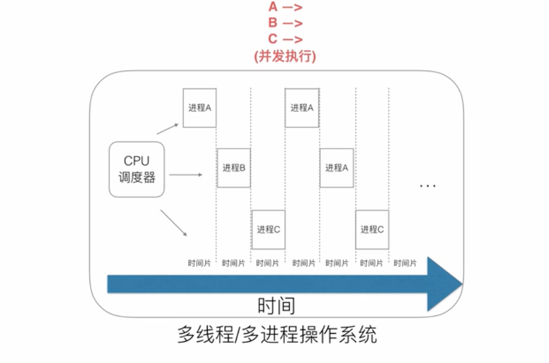


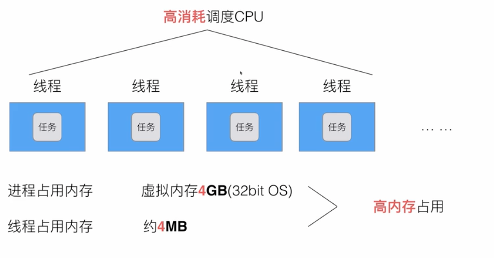


# 线程状态

线程可以有三中状态

<font color=green size=5x>等待中（waiting）</font>

- 这意味着线程停止并等待某件事情以继续，这可能是因为等待硬件（磁盘、网络）、操作系统（系统调用）或异步调用（原子、互斥）等原因，这些类型的延迟是性能下降的根本原因

<font color=green size=5x>待执行（Runnable）</font>

- 这意味着线程需要内核上的时间，以便执行它指定的机器指令。如果有很多线程都需要时间，那么线程需要等待更长的时间才能获得执行。此外，由于更多的线程在竞争，每个线程获得的单个执行时间都会缩短。这种类型的调度延迟也可能导致性能下降。

<font color=green size=5x>执行中（Executing）</font>

- 这意味着线程已经被放置在一个核心上，并且正在执行它的机器指令。与应用程序相关的工作正在完成。这是每个人都想要的。


# 线程工作状态

线程可以做两种类型的工作。第一个称为 **CPU-Bound**，第二个称为 **IO-Bound**。

<font color=green size=5x>**CPU-Bound**：</font>这种工作类型永远也不会让线程处在等待状态，因为这是一项不断进行计算的工作。比如计算 π 的第 n 位，就是一个 CPU-Bound 线程。

<font color=green size=5x>**IO-Bound**：</font>这是导致线程进入等待状态的工作类型。比如通过网络请求对资源的访问或对操作系统进行系统调用。

# go的协程

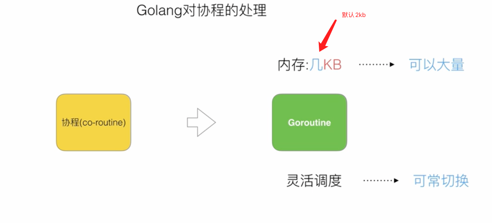

# go 早期的调度模型

<font color=red size=5x>go协程放入全局队列,M获取和放回要枷锁和解锁</font>

1. <font color=red size=5x>创建、销毁、调度G都需要每个M获取锁，这就形成了**激烈的锁竞争**。</font>
2. <font color=red size=5x>M转移G会造成**延迟和额外的系统负载**。比如当G中包含创建新协程的时候，M创建了G’，为了继续执行G，需要把G’交给M’执行，也造成了**很差的局部性**，因为G’和G是相关的，最好放在M上执行，而不是其他M'。</font>
3. <font color=red size=5x>系统调用(CPU在M之间的切换)导致频繁的线程阻塞和取消阻塞操作增加了系统开销。</font>


# 异步网络调用

当系统执行异步的网路调用的时候，会使用<font color=red size=5x>网络轮询器的东西（netpoll）来更有效地处理系统调用</font>,此时，会将G交给网络轮训器来执行


# 同步系统调用

M会和P解绑定，M阻塞等G的执行，P在下一个G启动的时候寻找新的M的绑定执行，当此M执行完毕会优先寻找之前绑定的P，如果此时P不处于空闲状态，M查找其他的P，如果没有空闲的P。M会将G放入全局队列，等带执行

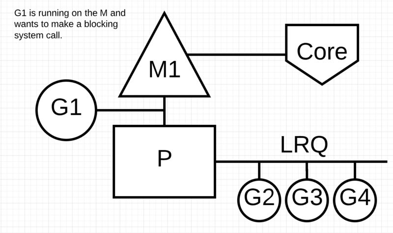

调度器介入后：识别出**`G1`**已导致**`M1`**阻塞，此时，调度器将**`M1`**与**`P`**分离，同时也将**`G1`**带走。然后调度器引入新的**`M2`**来服务**`P`**。此时，可以从 LRQ 中选择**`G2`**并在**`M2`**上进行上下文切换。

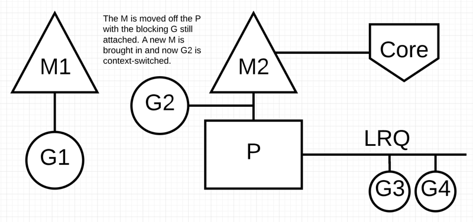

阻塞的系统调用完成后：**`G1`**可以移回 LRQ 并再次由**`P`**执行。如果这种情况需要再次发生，M1将被放在旁边以备将来使用。

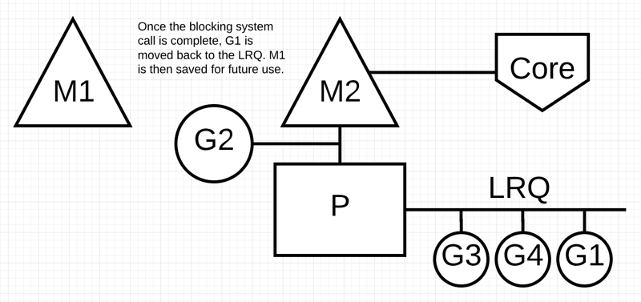


# 抢占调度

在`runtime.main`中会创建一个额外m运行`sysmon`函数，抢占就是在sysmon中实现的。

<font color=red size=5x>sysmon会进入一个无限循环, ==第一轮回休眠20us, 之后每次休眠时间倍增, 最终每一轮都会休眠10ms.== sysmon中有netpool(获取fd事件), retake(抢占), forcegc(按时间强制执行gc), scavenge heap(释放自由列表中多余的项减少内存占用)等处理。</font>

## 2、**抢占条件**：

1. 如果 P 在系统调用中，且时长已经过一次 sysmon 后，则抢占；

调用 `handoffp` 解除 M 和 P 的关联。

1. 如果 P 在运行，且时长经过一次 sysmon 后，并且时长超过设置的阻塞时长，则抢占；

设置标识，标识该函数可以被中止，当调用栈识别到这个标识时，就知道这是抢占触发的, 这时会再检查一遍是否要抢占。

# 抢占思想

1. sysmon中定期扫描正在执行的g列表,筛选出执行时间过长的g并且设置需要被抢占的标签.
2. 在恰当的地方检测被抢占标记,(runtime主动)切换,让出cpu.


## 1、创建时间

<font color=red size=5x>sysmon不和任何的P绑定，是单独运行，负责G的监控及抢占</font>

sysmon函数是Go runtime启动时创建的，负责监控所有goroutine的状态，判断是否需要GC，进行netpoll等操作。sysmon函数中会调用retake函数进行抢占式调度。


## 2、抢占周期

关于扫描周期,至少是`20us`一个循环,后面视`idle`循环次数来进行`指数退避`(超过1ms之后倍增),但最长时间不超过`10ms`,故系统至多在`10ms`左右进行一次抢占检测.

<font color=red size=5x>也就是说当sysmon检测到M被阻塞了10ms，就会解绑M和P，然后别的M抢占P进行执行</font>


## 3、 怎么检测的

<font color=red size=5x>有计数来记录P的调度次数，还会记录上次执行的时间，如果下次检测P调度次数没有增加，则将当前时间更新，然后将P和M绑定，将当前的G和M绑定执行</font>

1. 通过遍历allp列表来获取正在运行的g.
2. 状态检测.

```
        t := int64(_p_.schedtick)
      if int64(pd.schedtick) != t { //在周期内已经调度过,即当前p上运行的g改变过.
                pd.schedtick = uint32(t)
                pd.schedwhen = now //更新最近一次抢占检测的时间
                continue
            }
            if pd.schedwhen+forcePreemptNS > now { 
                continue
            }
            preemptone(_p_)
```

从上面关键数据结构得知 p.schedtick 记录了这个P上总共调度次数(递增), 故`sysmon`通过比较最近一次记录的`schedtick` 即可判断在一个周期内是否发生过调度行为.

通过最近一次检测时间与当前时间比较来明确是否需要抢占标记`pd.schedwhen+forcePreemptNS>now`

`forcePreemptNS`为`10ms` ,如果超过10ms没有调度,则需要抢占, PS:并不能保证一个G最多运行10ms.

最后通过`preemptone`来标记当前G需要被抢占

## 3、抢占触发

`func preemptone` 注释已经说了(runtime的注释很好),抢占触发时机: 目标g进行函数调用中触发栈检测过程中进行.

```
func testfunc()(sum int){
    var nums[100] int
    for _, num := range nums {
        sum += num
    }
    return
}
```


# GMP模型

- 本地队列不超过256G,优先将创建的G放入本地队列
- 最多可以有GOMAXPROCS个P
- M分配的线程数,最大1万,runtime/debug/SetMaxThread,动态控制,有空闲回收,不够创建
- 


# 调度器的设计策略---待补充

## 1、复用线程

避免频繁的创建、销毁线程，而是对线程的复用。

1）work stealing机制

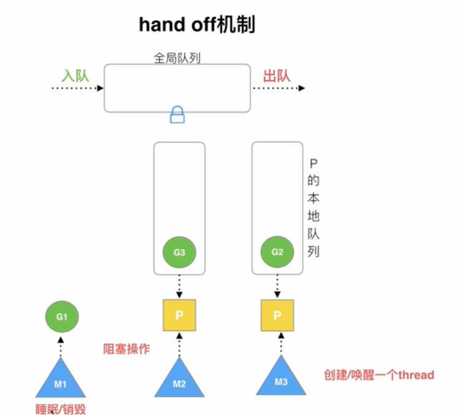


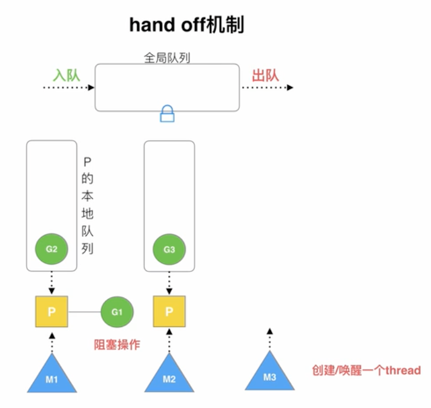


## 2、利用并行


## 3、抢占

- 每个G最多10ms,后台sysmon监控


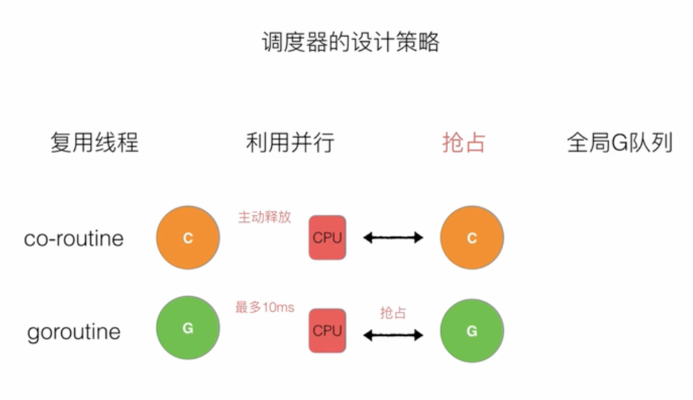

## 4、work stealing机制

- 优先从别的队列获取,每次获取二分之1,没有的话从全局队列,从别的本地队列偷的话,

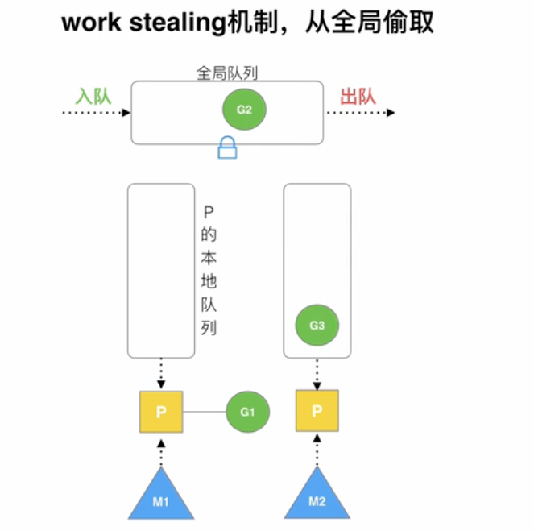


# go func过程

- 创建goroutine,优先放入本地队列,如果本地队列满了,放入全局,如果本地队列满了,优先从其他队列偷取,
- 一定时间也会去全局队列获取,防止饿死
- 


# M0 和G0的初始化

## M0 & G0

- <font color=red size=5x>M0在全局runtine.m0中,不需要在heap上分配,最大的栈</font>
- <font color=red size=5x>M0是没有栈增长检测的,绑定的G0是没有栈增长检测的,其他协程执行的函数都是G0最后执行的</font>
- <font color=green size=5x>G0是线程唯一的,负责调度其他的协程,其他G1到G2,要经过G0</font>
- <font color=green size=5x>在`调度或者系统调用`时,会使用M切换到G0,来调度M0的G0,会放在全局空间</font>
- <font color=green size=5x></font>
- <font color=green size=5x></font>

## 执行流程


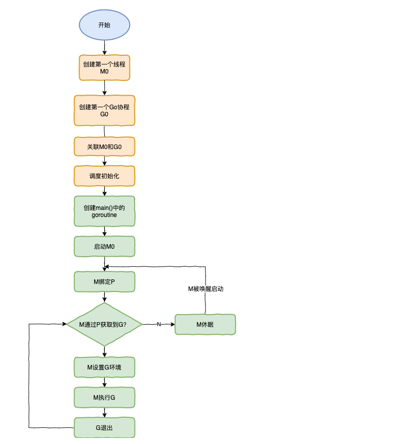


## 可视化查看调度过程 trace

```
package main

import (
	"fmt"
	"log"
	"os"
	"runtime/trace"
)

func main() {
	//创建文件
	f, err := os.Create("trace.out")
	if err != nil {
		log.Fatal(err)
	}
	defer f.Close()

	//启动
	err = trace.Start(f)

	fmt.Println("hello")

	trace.Stop()

}

```


```
 go run -race test.go
```

打开文件

```
go tool trace trace.out                                             
2020/12/15 20:53:44 Parsing trace...
2020/12/15 20:53:44 Splitting trace...
2020/12/15 20:53:44 Opening browser. Trace viewer is listening on http://127.0.0.1:54494

```

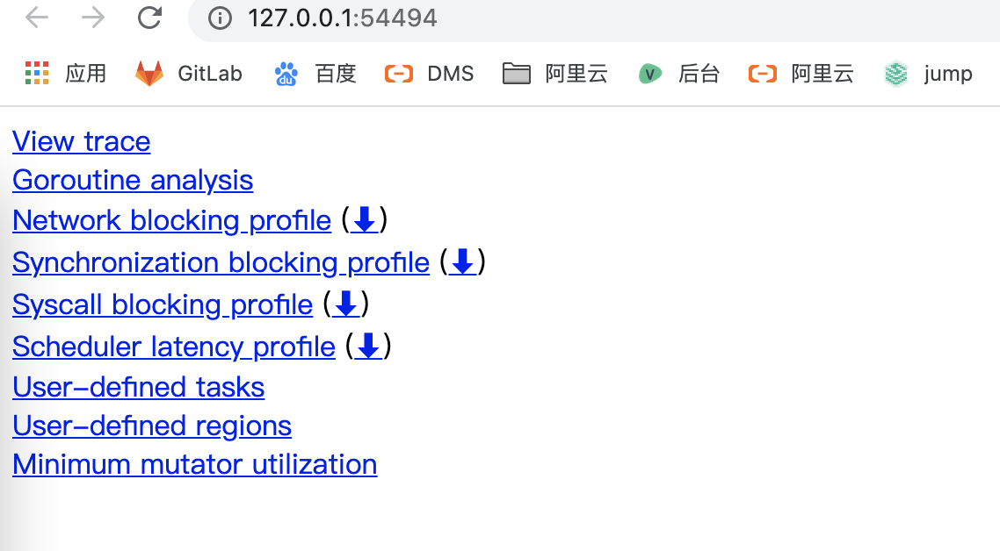


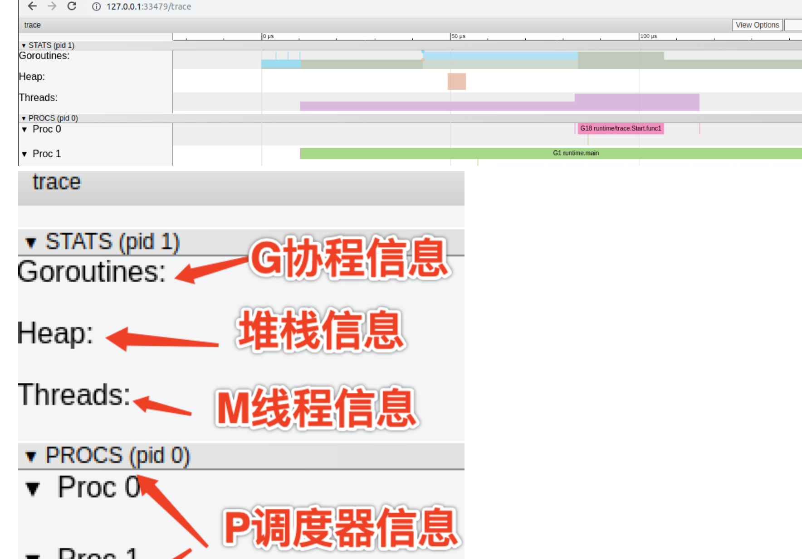


## GODEBUG

```
package main

import (
	"fmt"
	"time"
)

func main() {
	for i := 0; i < 50; i++ {
		time.Sleep(1 * time.Second)
		fmt.Println("hello")
	}
}

```


```
go build -o test2 test.go
```


```
GODEBUG=schedtrace=1000 ./test2
SCHED 0ms: gomaxprocs=8 idleprocs=5 threads=4 spinningthreads=1 idlethreads=0 runqueue=0 [1 0 0 0 0 0 0 0]
hello
SCHED 1004ms: gomaxprocs=8 idleprocs=8 threads=5 spinningthreads=0 idlethreads=3 runqueue=0 [0 0 0 0 0 0 0 0]
hello
SCHED 2012ms: gomaxprocs=8 idleprocs=8 threads=5 spinningthreads=0 idlethreads=3 runqueue=0 [0 0 0 0 0 0 0 0]
hello
SCHED 3017ms: gomaxprocs=8 idleprocs=8 threads=5 spinningthreads=0 idlethreads=3 runqueue=0 [0 0 0 0 0 0 0 0]
hello
SCHED 4022ms: gomaxprocs=8 idleprocs=8 threads=5 spinningthreads=0 idlethreads=3 runqueue=0 [0 0 0 0 0 0 0 0]
hello

```

SCHED 0ms: gomaxprocs=8 idleprocs=5 threads=4 spinningthreads=1 idlethreads=0 runqueue=0 [1 0 0 0 0 0 0 0]
hello

gomaxprocs=8  最大线程数

idleprocs=5 空闲的线程数

threads=4 使用线程数

spinningthreads=1 自旋线程

idlethreads=0 空闲线程

runqueue=0 [1 0 0 0 0 0 0 0]  第一个0 全局队列 然后是每个本地队列G的数量


# GMP 场景分析

## 1、 G1 创建G3

<font color=green size=5x>当G1创建G3,为了保持局部性,优先加入G1所在的本地队列</font>

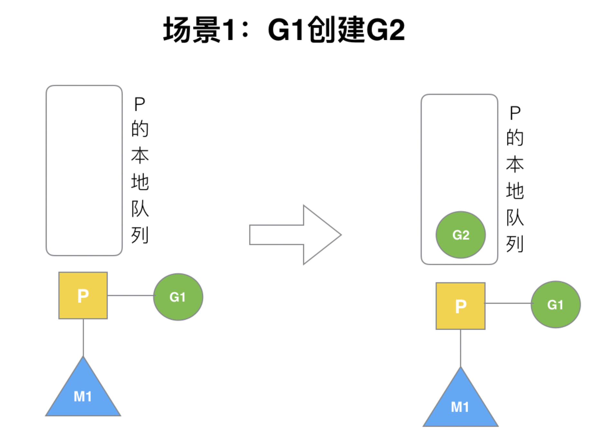


## 2、 G1 执行完毕

<font color=green size=5x>M优先从自己的本地队列获取G2执行</font>

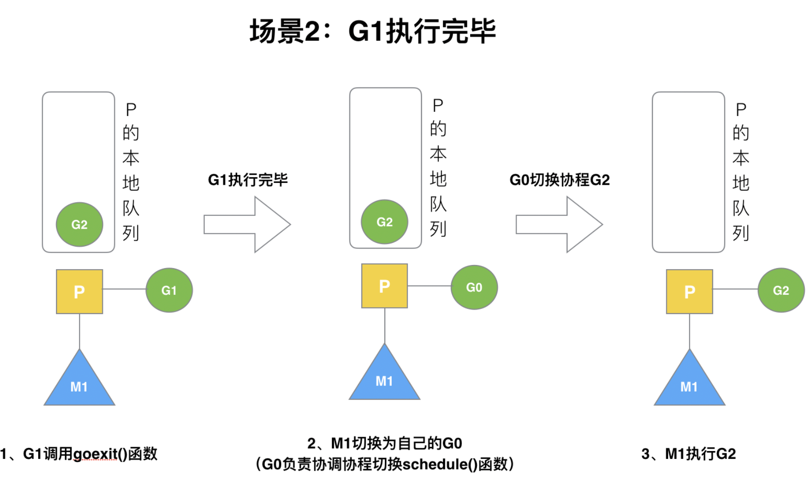


## 3、 G2开辟过多的G


<font color=green size=5x>假设只能存4个G,那么由G2创建的G也会加入到本地队列</font>

<font color=red size=5x>将本地队列从1/2划分,将头部的打乱和新创建的加入到全局队列,尾部的往前推</font>

<font color=green size=5x>假设只能存4个G,那么由G2创建的G也会加入到本地队列</font>

<font color=green size=5x>假设只能存4个G,那么由G2创建的G也会加入到本地队列</font>


<font color=red size=5x>将本地队列从1/2划分,将头部的打乱和新创建的加入到全局队列,尾部的往前推,保证优先度一样</font>

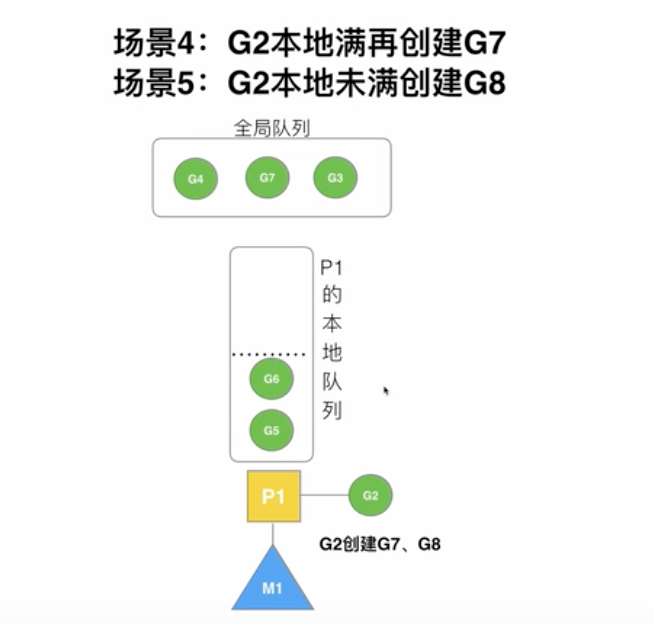


##  4、 本地队列满在创建G

<font color=red size=5x>将本地队列从1/2划分,将头部的打乱和新创建的加入到全局队列,尾部的往前推,保证优先度一样</font>


## 5、唤醒正在休眠的M


<font color=green size=5x>每创建一个G的时候,尝试唤醒休眠队列的的一个M(前提是休眠M队列有M),然后和空闲的P绑定,没有的话,重新回到休眠队列</font>

<font color=red size=5x>此时绑定了M的P就是自旋线程,会从别处偷取G执行</font>

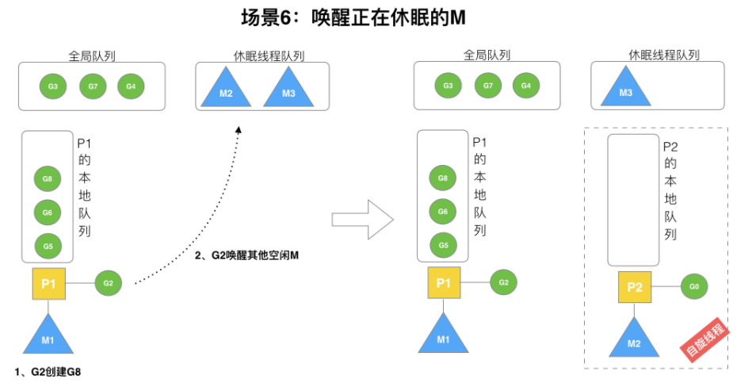


## 6、被唤醒的M2 从全局队列获取执行

<font color=green size=5x>唤醒的M2,从全局队列获取G执行</font>

<font color=red size=5x>调用G0切换到G3,执行,此时就不是自旋线程了</font>


<font color=blue size=5x>全局队列获取的个数`</font>

```
n = min(len(GQ)/GOMAXPROCS+1,len(GQ/2))

GQ 全局队列G
```


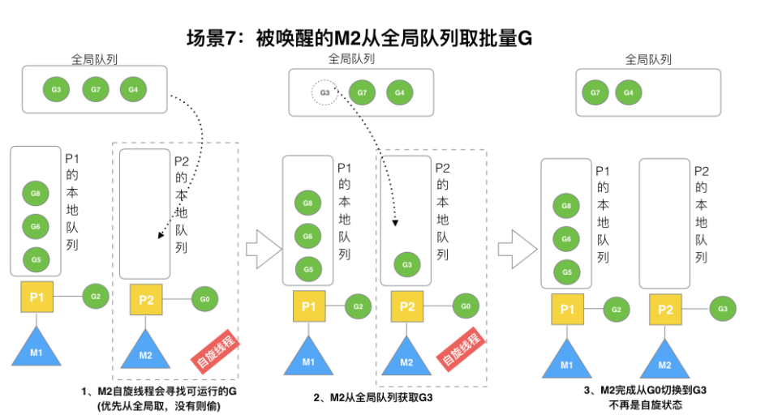


## 8、 M2从M1 偷取后半部分执行

<font color=green size=5x>M2被唤醒之后是自旋线程,全局队列位空</font>

<font color=red size=5x>此时从其他队列偷取一半,的后半部分来到自己的本地队列执行</font>


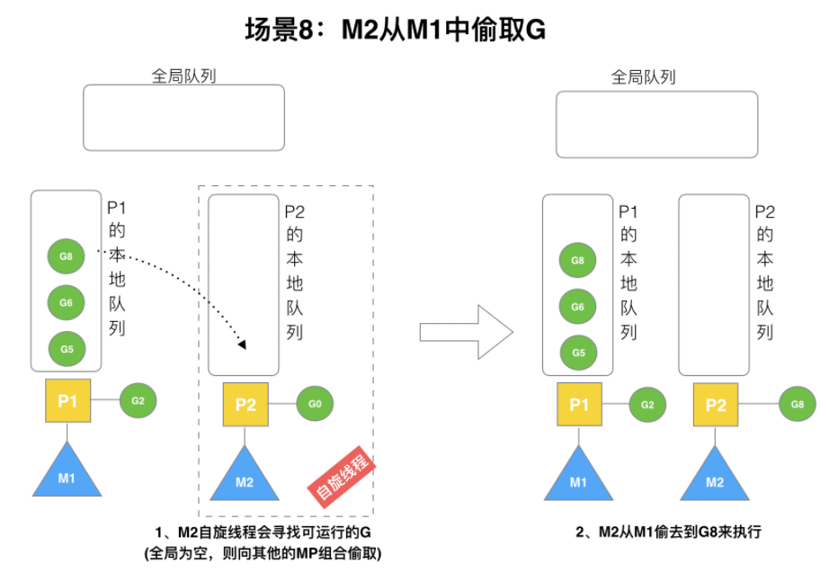


## 9、自旋线程的最大限制

<font color=green size=5x>GOMAXPROCESS控制P的数量</font>

<font color=red size=5x>最大的自旋线程数为GOMAXPROCESS-不是自旋的线程数</font>

<font color=red size=5x>其他线程放入休眠线程池中</font>


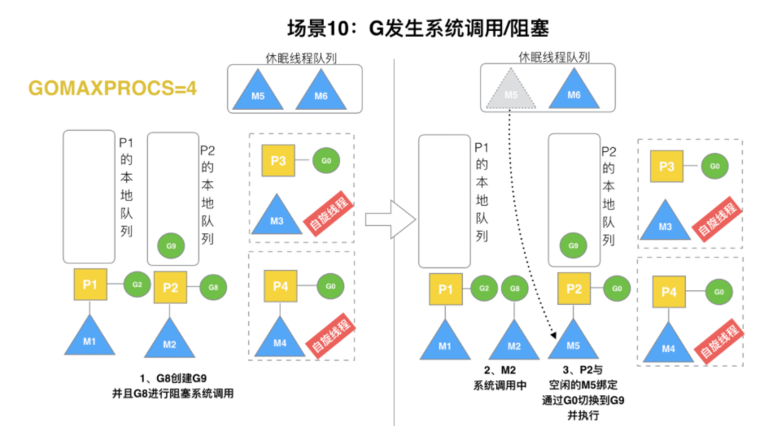


## 10、G发生系统调用/阻塞

<font color=green size=5x>当M2发生系统调用或者网络请求阻塞的时候,M2会和P2解绑</font>

<font color=red size=5x>解绑后的P2会寻找是否有空闲的M,如果有,就和其绑定,没有放入空闲P队列中</font>


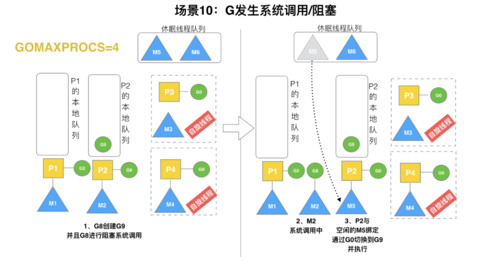


## 11、G从阻塞到不阻塞


<font color=red size=5x>当阻塞的G和M2不阻塞之后,M2必须有P才可以执行G,优先获取P2</font>

<font color=green size=5x>此时P2和P5绑定,那么会从空闲的P队列中获取是否有空空闲的P</font>

<font color=green size=5x>如果没有,那么G会和M2解绑,将G放入全局队列</font>

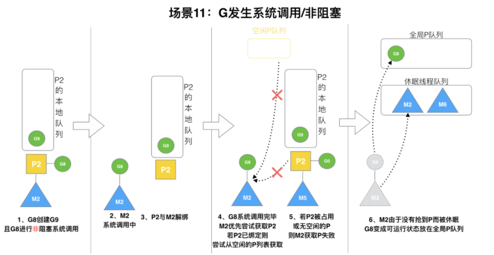


## 12、休眠队列的回收


<font color=green size=5x>如果休眠线程队列长期没有被唤醒,就会被GC回收</font>


