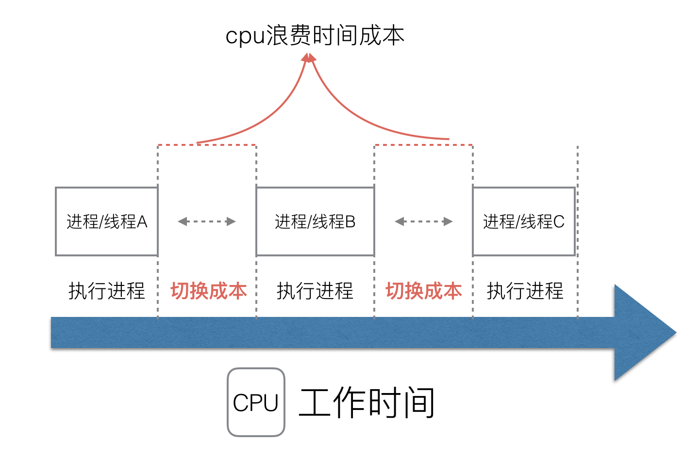

# 传统并发

<font color=red size=5x>cpu切换浪费成本</font>





# go的协程


# go 早期的调度模型

<font color=red size=5x>go协程放入全局队列,M获取和放回要枷锁和解锁</font>

1. <font color=red size=5x>创建、销毁、调度G都需要每个M获取锁，这就形成了**激烈的锁竞争**。</font>
2. <font color=red size=5x>M转移G会造成**延迟和额外的系统负载**。比如当G中包含创建新协程的时候，M创建了G’，为了继续执行G，需要把G’交给M’执行，也造成了**很差的局部性**，因为G’和G是相关的，最好放在M上执行，而不是其他M'。</font>
3. <font color=red size=5x>系统调用(CPU在M之间的切换)导致频繁的线程阻塞和取消阻塞操作增加了系统开销。</font>


# GMP模型

- 本地队列不超过256G,优先将创建的G放入本地队列
- 最多可以有GOMAXPROCS个P
- M分配的线程数,最大1万,runtime/debug/SetMaxThread,动态控制,有空闲回收,不够创建
- 


# 调度器的设计策略---待补充

## 1、复用线程

避免频繁的创建、销毁线程，而是对线程的复用。

1）work stealing机制


## 2、利用并行


## 3、抢占

- 每个G最多10ms,后台sysmon监控


## 4、work stealing机制

- 优先从别的队列获取,每次获取二分之1,没有的话从全局队列,从别的本地队列偷的话,


# go func过程

- 创建goroutine,优先放入本地队列,如果本地队列满了,放入全局,如果本地队列满了,优先从其他队列偷取,
- 一定时间也会去全局队列获取,防止饿死
- 


# M0 和G0的初始化

## M0 & G0

- <font color=red size=5x>M0在全局runtine.m0中,不需要在heap上分配,最大的栈</font>
- <font color=red size=5x>M0是没有栈增长检测的,绑定的G0是没有栈增长检测的,其他协程执行的函数都是G0最后执行的</font>
- <font color=green size=5x>G0是线程唯一的,负责调度其他的协程,其他G1到G2,要经过G0</font>
- <font color=green size=5x>在`调度或者系统调用`时,会使用M切换到G0,来调度M0的G0,会放在全局空间</font>
- <font color=green size=5x></font>
- <font color=green size=5x></font>

## 执行流程


## 可视化查看调度过程 trace

```
package main

import (
	"fmt"
	"log"
	"os"
	"runtime/trace"
)

func main() {
	//创建文件
	f, err := os.Create("trace.out")
	if err != nil {
		log.Fatal(err)
	}
	defer f.Close()

	//启动
	err = trace.Start(f)

	fmt.Println("hello")

	trace.Stop()

}

```


```
 go run -race test.go
```

打开文件

```
go tool trace trace.out                                             
2020/12/15 20:53:44 Parsing trace...
2020/12/15 20:53:44 Splitting trace...
2020/12/15 20:53:44 Opening browser. Trace viewer is listening on http://127.0.0.1:54494

```


## GODEBUG

```
package main

import (
	"fmt"
	"time"
)

func main() {
	for i := 0; i < 50; i++ {
		time.Sleep(1 * time.Second)
		fmt.Println("hello")
	}
}

```


```
go build -o test2 test.go
```


```
GODEBUG=schedtrace=1000 ./test2
SCHED 0ms: gomaxprocs=8 idleprocs=5 threads=4 spinningthreads=1 idlethreads=0 runqueue=0 [1 0 0 0 0 0 0 0]
hello
SCHED 1004ms: gomaxprocs=8 idleprocs=8 threads=5 spinningthreads=0 idlethreads=3 runqueue=0 [0 0 0 0 0 0 0 0]
hello
SCHED 2012ms: gomaxprocs=8 idleprocs=8 threads=5 spinningthreads=0 idlethreads=3 runqueue=0 [0 0 0 0 0 0 0 0]
hello
SCHED 3017ms: gomaxprocs=8 idleprocs=8 threads=5 spinningthreads=0 idlethreads=3 runqueue=0 [0 0 0 0 0 0 0 0]
hello
SCHED 4022ms: gomaxprocs=8 idleprocs=8 threads=5 spinningthreads=0 idlethreads=3 runqueue=0 [0 0 0 0 0 0 0 0]
hello

```

SCHED 0ms: gomaxprocs=8 idleprocs=5 threads=4 spinningthreads=1 idlethreads=0 runqueue=0 [1 0 0 0 0 0 0 0]
hello

gomaxprocs=8  最大线程数

idleprocs=5 空闲的线程数

threads=4 使用线程数

spinningthreads=1 自旋线程

idlethreads=0 空闲线程

runqueue=0 [1 0 0 0 0 0 0 0]  第一个0 全局队列 然后是每个本地队列G的数量


# GMP 场景分析

## 1、 G1 创建G3

<font color=green size=5x>当G1创建G3,为了保持局部性,优先加入G1所在的本地队列</font>


## 2、 G1 执行完毕

<font color=green size=5x>M优先从自己的本地队列获取G2执行</font>


## 3、 G2开辟过多的G


<font color=green size=5x>假设只能存4个G,那么由G2创建的G也会加入到本地队列</font>

<font color=red size=5x>将本地队列从1/2划分,将头部的打乱和新创建的加入到全局队列,尾部的往前推</font>

<font color=green size=5x>假设只能存4个G,那么由G2创建的G也会加入到本地队列</font>

<font color=green size=5x>假设只能存4个G,那么由G2创建的G也会加入到本地队列</font>


<font color=red size=5x>将本地队列从1/2划分,将头部的打乱和新创建的加入到全局队列,尾部的往前推,保证优先度一样</font>


##  4、 本地队列满在创建G

<font color=red size=5x>将本地队列从1/2划分,将头部的打乱和新创建的加入到全局队列,尾部的往前推,保证优先度一样</font>


## 5、唤醒正在休眠的M


<font color=green size=5x>每创建一个G的时候,尝试唤醒休眠队列的的一个M(前提是休眠M队列有M),然后和空闲的P绑定,没有的话,重新回到休眠队列</font>

<font color=red size=5x>此时绑定了M的P就是自旋线程,会从别处偷取G执行</font>


## 6、被唤醒的M2 从全局队列获取执行

<font color=green size=5x>唤醒的M2,从全局队列获取G执行</font>

<font color=red size=5x>调用G0切换到G3,执行,此时就不是自旋线程了</font>


