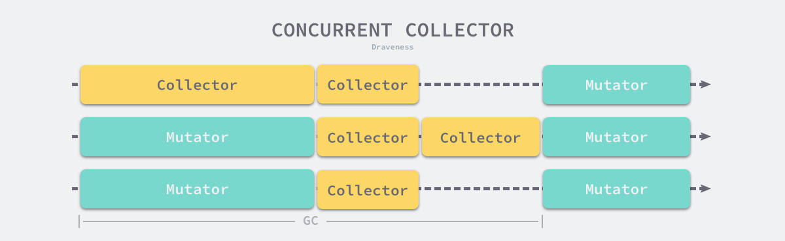

# 内存的由来

1. 如果CPU直接访问硬盘，CPU能充分利用吗？
2. 如果CPU直接访问内存，CPU能充分利用吗？

CPU速度很快，但硬盘等持久存储很慢，如果CPU直接访问磁盘，磁盘可以拉低CPU的速度，机器整体性能就会低下，为了弥补这2个硬件之间的速率差异，所以在CPU和磁盘之间增加了比磁盘快很多的内存。


然而，CPU跟内存的速率也不是相同的，从上图可以看到，CPU的速率提高的很快（摩尔定律），然而内存速率增长的很慢，**虽然CPU的速率现在增加的很慢了，但是内存的速率也没增加多少，速率差距很大**，从1980年开始CPU和内存速率差距在不断拉大，为了弥补这2个硬件之间的速率差异，所以在CPU跟内存之间增加了比内存更快的Cache，Cache是内存数据的缓存，可以降低CPU访问内存的时间.


三级Cache分别是L1、L2、L3，它们的速率是三个不同的层级，L1速率最快，与CPU速率最接近，是RAM速率的100倍，L2速率就降到了RAM的25倍，L3的速率更靠近RAM的速率。


# 虚拟内存


上图展示了某进程访问数据，当Cache没有命中的时候，访问虚拟内存获取数据的过程。

访问内存，实际访问的是虚拟内存，虚拟内存通过页表查看，当前要访问的虚拟内存地址，是否已经加载到了物理内存，如果已经在物理内存，则取物理内存数据，如果没有对应的物理内存，则从磁盘加载数据到物理内存，并把物理内存地址和虚拟内存地址更新到页表。

**物理内存就是磁盘存储缓存层**。

另外，在没有虚拟内存的时代，物理内存对所有进程是共享的，多进程同时访问同一个物理内存存在并发访问问题。**引入虚拟内存后，每个进程都要各自的虚拟内存，内存的并发访问问题的粒度从多进程级别，可以降低到多线程级别**。

# 堆和栈


上图展示了一个进程的虚拟内存划分，代码中使用的内存地址都是虚拟内存地址，而不是实际的物理内存地址。栈和堆只是虚拟内存上2块不同功能的内存区域：

- **栈在高地址，从高地址向低地址增长。**
- **堆在低地址，从低地址向高地址增长。**

**栈和堆相比有这么几个好处**：

1. <font color=red size=5x>栈的内存管理简单，分配比堆上快。</font>
2. <font color=blue size=5x>栈的内存不需要回收，而堆需要，无论是主动free，还是被动的垃圾回收，这都需要花费额外的CPU。</font>
3. <font color=red size=5x>栈上的内存有更好的局部性，堆上内存访问就不那么友好了，CPU访问的2块数据可能在不同的页上，CPU访问数据的时间可能就上去了。</font>


# 堆内存管理


当我们说内存管理的时候，主要是指堆内存的管理，因为栈的内存管理不需要程序去操心。这小节看下堆内存管理干的是啥，如上图所示主要是3部分：**分配内存块，回收内存块和组织内存块**。

在一个最简单的内存管理中，堆内存最初会是一个完整的大块，即未分配内存，当来申请的时候，就会从未分配内存，分割出一个小内存块(block)，然后用链表把所有内存块连接起来。需要一些信息描述每个内存块的基本信息，比如大小(size)、是否使用中(used)和下一个内存块的地址(next)，内存块实际数据存储在data中。


一个内存块包含了3类信息，如下图所示，元数据、用户数据和对齐字段，内存对齐是为了提高访问效率。下图申请5Byte内存的时候，就需要进行内存对齐。

go中map的实现也是应用到了内存对齐


==释放内存实质是把使用的内存块从链表中取出来，然后标记为未使用，当分配内存块的时候，可以从未使用内存块中有先查找大小相近的内存块，如果找不到，再从未分配的内存中分配内存。==

上面这个简单的设计中还没考虑内存碎片的问题，因为随着内存不断的申请和释放，内存上会存在大量的碎片，降低内存的使用率。为了解决内存碎片，可以将2个连续的未使用的内存块合并，减少碎片。


#  ==---------**TCMalloc**---------==

**TCMalloc是Thread Cache Malloc的简称，是Go内存管理的起源**，<font color=red size=5x>Go的内存管理是借鉴了TCMalloc，并不是完全使用</font>随着Go的迭代，Go的内存管理与TCMalloc不一致地方在不断扩大，但**其主要思想、原理和概念都是和TCMalloc一致的**，如果跳过TCMalloc直接去看Go的内存管理，也许你会似懂非懂。


在Linux里，其实有不少的内存管理库，比如glibc的ptmalloc，FreeBSD的jemalloc，Google的tcmalloc等等，为何会出现这么多的内存管理库？本质都是**在多线程编程下，追求更高内存管理效率**：更快的分配是主要目的。

## TCMalloc的做法是什么呢？

**为每个线程预分配一块缓存，线程申请小内存时，可以从缓存分配内存**，这样有2个好处：

1. 为线程预分配缓存需要进行1次系统调用，后续线程申请小内存时，从缓存分配，都是在用户态执行，没有系统调用，**缩短了内存总体的分配和释放时间，这是快速分配内存的第二个层次**。
2. 多个线程同时申请小内存时，从各自的缓存分配，访问的是不同的地址空间，无需加锁，**把内存并发访问的粒度进一步降低了，这是快速分配内存的第三个层次**。


<font color=red size=5x>==Page==</font>：操作系统对内存管理以页为单位，TCMalloc也是这样，只不过TCMalloc里的Page大小与操作系统里的大小并不一定相等，而是倍数关系。《TCMalloc解密》里称x64下Page大小是8KB。

<font color=red size=5x>==Span==</font>：一组连续的Page被称为Span，比如可以有2个页大小的Span，也可以有16页大小的Span，Span比Page高一个层级，是为了方便管理一定大小的内存区域，Span是TCMalloc中内存管理的基本单位。

<font color=red size=5x>==ThreadCache==</font>**：每个线程各自的Cache，一个Cache包含多个空闲内存块链表，每个链表连接的都是内存块，同一个链表上内存块的大小是相同的，也可以说按内存块大小，给内存块分了个类，这样可以根据申请的内存大小，快速从合适的链表选择空闲内存块。由于每个线程有自己的ThreadCache，所以ThreadCache访问是无锁的。**

<font color=red size=5x>==CentralCache==</font>：是所有线程共享的缓存，也是保存的空闲内存块链表，链表的数量与ThreadCache中链表数量相同，当ThreadCache内存块不足时，可以从CentralCache取，当ThreadCache内存块多时，可以放回CentralCache。由于CentralCache是共享的，**所以它的访问是要加锁的。**

<font color=red size=5x>==PageHeap==</font>：PageHeap是堆内存的抽象，PageHeap存的也是若干链表，链表保存的是Span，当CentralCache没有内存的时，会从PageHeap取，把1个Span拆成若干内存块，添加到对应大小的链表中，当CentralCache内存多的时候，会放回PageHeap。如下图，分别是1页Page的Span链表，2页Page的Span链表等，最后是large span set，这个是用来保存中大对象的。毫无疑问，**PageHeap也是要加锁的**。


上文提到了小、中、大对象，Go内存管理中也有类似的概念，我们瞄一眼TCMalloc的定义：

1. 小对象大小：0~256KB
2. 中对象大小：257~1MB
3. 大对象大小：>1MB

小对象的分配流程：ThreadCache -> CentralCache -> HeapPage，大部分时候，ThreadCache缓存都是足够的，不需要去访问CentralCache和HeapPage，无锁分配加无系统调用，分配效率是非常高的。

中对象分配流程：直接在PageHeap中选择适当的大小即可，128 Page的Span所保存的最大内存就是1MB。

大对象分配流程：从large span set选择合适数量的页面组成span，用来存储数据。


# ==---------- Go内存管理-------==


**Page**

与TCMalloc中的Page相同，x64下1个Page的大小是8KB。上图的最下方，1个浅蓝色的长方形代表1个Page。

**Span**

与TCMalloc中的Span相同，**Span是内存管理的基本单位**，代码中为mspan，**一组连续的Page组成1个Span**，所以上图一组连续的浅蓝色长方形代表的是一组Page组成的1个Span，另外，1个淡紫色长方形为1个Span。

**mcache**

mcache与TCMalloc中的ThreadCache类似，**mcache保存的是各种大小的Span，并按Span class分类，小对象直接从mcache分配内存，它起到了缓存的作用，并且可以无锁访问**。

但mcache与ThreadCache也有不同点，TCMalloc中是每个线程1个ThreadCache，<font color=red size=6x>Go中是**每个P拥有1个mcache**，因为在Go程序中，当前最多有GOMAXPROCS个线程在用户态运行，所以最多需要GOMAXPROCS个mcache就可以保证各线程对mcache的无锁访问，线程的运行又是与P绑定的，把mcache交给P刚刚好。</font>

**mcentral**

mcentral与TCMalloc中的CentralCache类似，**是所有线程共享的缓存，需要加锁访问**，它按Span class对Span分类，串联成链表，当mcache的某个级别Span的内存被分配光时，它会向mcentral申请1个当前级别的Span。

但mcentral与CentralCache也有不同点，CentralCache是每个级别的Span有1个链表，mcache是每个级别的Span有2个链表，这和mcache申请内存有关，稍后我们再解释。

**mheap**

mheap与TCMalloc中的PageHeap类似，**它是堆内存的抽象，把从OS申请出的内存页组织成Span，并保存起来**。当mcentral的Span不够用时会向mheap申请，mheap的Span不够用时会向OS申请，向OS的内存申请是按页来的，然后把申请来的内存页生成Span组织起来，同样也是需要加锁访问的。

但mheap与PageHeap也有不同点：mheap把Span组织成了树结构，而不是链表，并且还是2棵树，然后把Span分配到heapArena进行管理，它包含地址映射和span是否包含指针等位图，这样做的主要原因是为了更高效的利用内存：分配、回收和再利用。

## **大小转换**


1. **object size**：代码里简称size，指申请内存的对象大小。
2. **size class**：代码里简称class，它是size的级别，相当于把size归类到一定大小的区间段，比如size[1,8]属于size class 1，size(8,16]属于size class 2。
3. **span class**：指span的级别，但span class的大小与span的大小并没有正比关系。span class主要用来和size class做对应，1个size class对应2个span class，2个span class的span大小相同，只是功能不同，1个用来存放包含指针的对象，一个用来存放不包含指针的对象，不包含指针对象的Span就无需GC扫描了。
4. **num of page**：代码里简称npage，代表Page的数量，其实就是Span包含的页数，用来分配内存。


前3列分别是size class，object size和span size，根据这3列做size、size class和num of page之间的转换。


# 一般内存分配


# ==------go的内存分配核心思想-----==

Go的内存分配的核心思想可以分为以下几点：

- 每次从操作系统申请一大块儿的内存，由Go来对这块儿内存做分配，减少系统调用
- 内存分配算法采用Google的TCMalloc算法。算法比较复杂，究其原理可自行查阅。其核心思想就是把内存切分的非常的细小，分为多级管理，以降低锁的粒度。
- 回收对象内存时，并没有将其真正释放掉，只是放回预先分配的大块内存中，以便复用。只有内存闲置过多的时候，才会尝试归还部分内存给操作系统，降低整体开销

## 基础概念

为了方便自主管理内存，做法便是先向系统申请一块内存，然后将内存切割成小块，通过一定的内存分配算法管理内存。以64位系统为例，Golang程序启动时会向系统申请的内存如下图所示：


预申请的内存划分为spans、bitmap、arena三部分。其中arena即为所谓的堆区，应用中需要的内存从这里分配。其中spans和bitmap是为了管理arena区而存在的。

arena的大小为512G，为了方便管理把arena区域划分成一个个的page，每个page为8KB,一共有512GB/8KB个页；

spans区域存放span的指针，每个指针对应一个page，所以span区域的大小为(512GB/8KB)*指针大小8byte = 512M

bitmap区域大小也是通过arena计算出来，不过主要用于GC。

## <font color=red size=5x>span</font>

span是用于管理arena页的关键数据结构，每个span中包含1个或多个连续页，为了满足小对象分配，span中的一页会划分更小的粒度，而对于大对象比如超过页大小，则通过多页实现。


spans区域，可以认为是用于上面所说的管理分配arena(即heap)的区域。

此区域存放了mspan的指针，mspan是啥后面会讲。

spans区域用于表示arena区中的某一页(page)属于哪个mspan。


mspan可以说是go内存管理的最基本单元，但是内存的使用最终还是要落脚到“对象”上。mspan和对象是什么关系呢？

其实“对象”肯定也放到page中，毕竟page是内存存储的基本单元。

我们抛开问题不看，先看看一般情况下的对象和内存的分配是如何的：如下图

## 为什么存在mspan


假如再分配“p4”的时候，是不是内存不足没法分配了？是不是有很多碎片？

这种一般的分配情况会出现内存碎片的情况，go是如何解决的呢？

可以归结为四个字：按需分配。go将内存块分为大小不同的67种，然后再把这67种大内存块，逐个分为小块(可以近似理解为大小不同的相当于page)称之为span(连续的page)，在go语言中就是上文提及的mspan。


对象分配的时候，根据对象的大小选择大小相近的span，这样，碎片问题就解决了。67中不同大小的span代码注释如下(目前版本1.11)：

```
// class  bytes/obj  bytes/span  objects  waste bytes
//     1          8        8192     1024            0
//     2         16        8192      512            0
//     3         32        8192      256            0
//     4         48        8192      170           32
//     5         64        8192      128            0
//     6         80        8192      102           32
//     7         96        8192       85           32
//     8        112        8192       73           16
//     9        128        8192       64            0
//    10        144        8192       56          128
//    11        160        8192       51           32
//    12        176        8192       46           96
//    13        192        8192       42          128
//    14        208        8192       39           80
//    15        224        8192       36          128
//    16        240        8192       34           32
//    17        256        8192       32            0
//    18        288        8192       28          128
//    19        320        8192       25          192
//    20        352        8192       23           96
//    21        384        8192       21          128
//    22        416        8192       19          288
//    23        448        8192       18          128
//    24        480        8192       17           32
//    25        512        8192       16            0
//    26        576        8192       14          128
//    27        640        8192       12          512
//    28        704        8192       11          448
//    29        768        8192       10          512
//    30        896        8192        9          128
//    31       1024        8192        8            0
//    32       1152        8192        7          128
//    33       1280        8192        6          512
//    34       1408       16384       11          896
//    35       1536        8192        5          512
//    36       1792       16384        9          256
//    37       2048        8192        4            0
//    38       2304       16384        7          256
//    39       2688        8192        3          128
//    40       3072       24576        8            0
//    41       3200       16384        5          384
//    42       3456       24576        7          384
//    43       4096        8192        2            0
//    44       4864       24576        5          256
//    45       5376       16384        3          256
//    46       6144       24576        4            0
//    47       6528       32768        5          128
//    48       6784       40960        6          256
//    49       6912       49152        7          768
//    50       8192        8192        1            0
//    51       9472       57344        6          512
//    52       9728       49152        5          512
//    53      10240       40960        4            0
//    54      10880       32768        3          128
//    55      12288       24576        2            0
//    56      13568       40960        3          256
//    57      14336       57344        4            0
//    58      16384       16384        1            0
//    59      18432       73728        4            0
//    60      19072       57344        3          128
//    61      20480       40960        2            0
//    62      21760       65536        3          256
//    63      24576       24576        1            0
//    64      27264       81920        3          128
//    65      28672       57344        2            0
//    66      32768       32768        1            0
```

- class： class ID，每个span结构中都有一个class ID, 表示该span可处理的对象类型
- bytes/obj：该class代表对象的字节数
- bytes/span：每个span占用堆的字节数，也即页数*页大小
- objects: 每个span可分配的对象个数，也即（bytes/spans）/（bytes/obj）
- waste bytes: 每个span产生的内存碎片，也即（bytes/spans）%（bytes/obj）

以类型(class)为1的span为例,span中的元素大小是8 byte, span本身占1页也就是8K, 一共可以保存1024个对象。

细心的同学可能会发现代码中一共有66种，还有一种特殊的span：

==即对于大于32k的对象出现时，会直接从heap分配一个特殊的span，这个特殊的span的类型(class)是0, 只包含了一个大对象, span的大小由对象的大小决定。==

## bitmap

bitmap 有好几种:Stack, data, and bss bitmaps，再就是这次要说的heap bitmaps。

在此bitmap的做作用是标记标记arena(即heap)中的对象。<font color=red size=5x>一是的标记对应地址中是否存在对象，另外是标记此对象是否被gc标记过。一个功能一个bit位，所以，heap bitmaps用两个bit位。</font>

bitmap区域中的一个byte对应arena区域的四个指针大小的内存的结构如下：


bitmap的地址是由高地址向低地址增长的。

宏观图:


bitmap 主要的作用还是服务于GC。

arena中包含基本的管理单元和程序运行时候生成的对象或实体，这两部分分别被spans和bitmap这两块非heap区域的内存所对应着。

## 三者关系图


spans和bitmap都会根据arena的动态变化而动态调整大小。


# go内存管理组件

- mspan为内存管理的基础单元，直接存储数据的地方。
- mcache：每个运行期的goroutine都会绑定的一个mcache(具体来讲是绑定的GMP并发模型中的P，所以可以无锁分配mspan，后续还会说到)，mcache会分配goroutine运行中所需要的内存空间(即mspan)。
- mcentral为所有mcache切分好后备的mspan
- mheap代表Go程序持有的所有堆空间。还会管理闲置的span，需要时向操作系统申请新内存。


**Page**

与TCMalloc中的Page相同，x64下1个Page的大小是8KB。上图的最下方，1个浅蓝色的长方形代表1个Page。

**Span**

与TCMalloc中的Span相同，**Span是内存管理的基本单位**，代码中为mspan，**一组连续的Page组成1个Span**，所以上图一组连续的浅蓝色长方形代表的是一组Page组成的1个Span，另外，1个淡紫色长方形为1个Span。

**mcache**

mcache与TCMalloc中的ThreadCache类似，**mcache保存的是各种大小的Span，并按Span class分类，小对象直接从mcache分配内存，它起到了缓存的作用，并且可以无锁访问**。

但mcache与ThreadCache也有不同点，TCMalloc中是每个线程1个ThreadCache，Go中是**每个P拥有1个mcache**，因为在Go程序中，当前最多有GOMAXPROCS个线程在用户态运行，所以最多需要GOMAXPROCS个mcache就可以保证各线程对mcache的无锁访问，线程的运行又是与P绑定的，把mcache交给P刚刚好。

**mcentral**

mcentral与TCMalloc中的CentralCache类似，**是所有线程共享的缓存，需要加锁访问**，它按Span class对Span分类，串联成链表，当mcache的某个级别Span的内存被分配光时，它会向mcentral申请1个当前级别的Span。

但mcentral与CentralCache也有不同点，CentralCache是每个级别的Span有1个链表，mcache是每个级别的Span有2个链表，这和mcache申请内存有关，稍后我们再解释。

**mheap**

mheap与TCMalloc中的PageHeap类似，**它是堆内存的抽象，把从OS申请出的内存页组织成Span，并保存起来**。当mcentral的Span不够用时会向mheap申请，mheap的Span不够用时会向OS申请，向OS的内存申请是按页来的，然后把申请来的内存页生成Span组织起来，同样也是需要加锁访问的。

但mheap与PageHeap也有不同点：mheap把Span组织成了树结构，而不是链表，并且还是2棵树，然后把Span分配到heapArena进行管理，它包含地址映射和span是否包含指针等位图，这样做的主要原因是为了更高效的利用内存：分配、回收和再利用。


## ==---mspan---==

- <font color=red size=5x>mspan有134个,class是直接从heap分配的,>32kb的数据</font>

**Span**

与TCMalloc中的Span相同，**Span是内存管理的基本单位**，代码中为mspan，**一组连续的Page组成1个Span**


## span数据结构

span是内存管理的基本单位,每个span用于管理特定的class对象, 跟据对象大小，span将一个或多个页拆分成多个块进行管理。

`src/runtime/mheap.go:mspan`定义了其数据结构：

```go
type mspan struct {
    next *mspan            //链表前向指针，用于将span链接起来
    prev *mspan            //链表前向指针，用于将span链接起来
    startAddr uintptr // 起始地址，也即所管理页的地址
    npages    uintptr // 管理的页数
    nelems uintptr // 块个数，也即有多少个块可供分配
    allocBits  *gcBits //分配位图，每一位代表一个块是否已分配
    allocCount  uint16     // 已分配块的个数
    spanclass   spanClass  // class表中的class ID
    elemsize    uintptr    // class表中的对象大小，也即块大小
}
```

以class 10为例，span和管理的内存如下图所示：


spanclass为10，参照class表可得出npages=1,nelems=56,elemsize为144。其中startAddr是在span初始化时就指定了某个页的地址。allocBits指向一个位图，每位代表一个块是否被分配，本例中有两个块已经被分配，其allocCount也为2。

next和prev用于将多个span链接起来，这有利于管理多个span。


mspan是双向链表，其中主要的属性如下图所示：


## ==---mcache---==

为了避免多线程申请内存时不断的加锁，goroutine为每个线程分配了span内存块的缓存，这个缓存即是mcache，每个goroutine都会绑定的一个mcache，各个goroutine申请内存时不存在锁竞争的情况。

mcache与TCMalloc中的ThreadCache类似，**mcache保存的是各种大小的Span，并按Span class分类，小对象直接从mcache分配内存，它起到了缓存的作用，并且可以无锁访问**。

但mcache与ThreadCache也有不同点，TCMalloc中是每个线程1个ThreadCache，Go中是**每个P拥有1个mcache**，因为在Go程序中，当前最多有GOMAXPROCS个线程在用户态运行，所以最多需要GOMAXPROCS个mcache就可以保证各线程对mcache的无锁访问，线程的运行又是与P绑定的，把mcache交给P刚刚好。

<font color=red size=5x>因为运行期间一个goroutine只能和一个P关联，而mcache就在P上，所以，不可能有锁的竞争。</font>

## mcache数据结构

有了管理内存的基本单位span，还要有个数据结构来管理span，这个数据结构叫mcentral，各线程需要内存时从mcentral管理的span中申请内存，为了避免多线程申请内存时不断的加锁，Golang为每个线程分配了span的缓存，这个缓存即是cache。

`src/runtime/mcache.go:mcache`定义了cache的数据结构：

```
type mcache struct {
    alloc [67*2]*mspan // 按class分组的mspan列表
}
```

==alloc为mspan的指针数组，数组大小为class总数的2倍。==数组中每个元素代表了一种class类型的span列表，<font color=red size=5x>每种class类型都有两组span列表，`第一组列表中所表示的对象中包含了指针`，`第二组列表中所表示的对象不含有指针`，这么做是为了提高GC扫描性能，对于不包含指针的span列表，没必要去扫描。</font>


根据对象是否包含指针，将对象分为noscan和scan两类，其中noscan代表没有指针，而scan则代表有指针，需要GC进行扫描。

mcache和span的对应关系如下图所示：


mchache在初始化时是没有任何span的，在使用过程中会动态的从central中获取并缓存下来，跟据使用情况，每种class的span个数也不相同。上图所示，class 0的span数比class1的要多，说明本线程中分配的小对象要多一些。


## mcache为什么分为有指针和无指针

mcache中的span链表分为两组，一组是包含指针类型的对象，另一组是不包含指针类型的对象。为什么分开呢？

主要是方便GC，在进行垃圾回收的时候，对于不包含指针的对象列表无需进一步扫描是否引用其他活跃的对

<font color=red size=5x>对于 <=32k的对象，将直接通过mcache分配。</font>

go中对象按照的大小维度的分类。

分为三类：

- tinny allocations (size < 16 bytes，no pointers)
- small allocations (16 bytes < size <= 32k)
- large allocations (size > 32k)

前两类：tiny allocations和small allocations是直接通过mcache来分配的。

对于tiny allocations的分配，有一个微型分配器tiny allocator来分配，分配的对象都是不包含指针的，例如一些小的字符串和不包含指针的独立的逃逸变量等。

small allocations的分配，就是mcache根据对象的大小来找自身存在的大小相匹配mspan来分配。

当mcach没有可用空间时，会从mcentral的 mspans 列表获取一个新的所需大小规格的mspan。

## ==---mcentral---==

为所有mcache提供切分好的mspan。

每个mcentral保存一种特定类型的全局mspan列表，包括已分配出去的和未分配出去的。


有多少种类型的mspan就有多少个mcentral。

每个mcentral都会包含两个mspan的列表：

- 没有空闲对象或mspan已经被mcache缓存的mspan列表(empty mspanList)
- 有空闲对象的mspan列表(empty mspanList)

==由于mspan是全局的，会被所有的mcache访问，所以会出现并发性问题，因而mcentral会存在一个锁。==

单个的mcentral结构如下：


假如需要分配内存时，mcentral没有空闲的mspan列表了，此时需要向mheap去获取。

## mcentral数据结构

cache作为线程的私有资源为单个线程服务，而central则是全局资源，为多个线程服务，当某个线程内存不足时会向central申请，当某个线程释放内存时又会回收进central。

`src/runtime/mcentral.go:mcentral`定义了central数据结构：

```
type mcentral struct {
    lock      mutex     //互斥锁
    spanclass spanClass // span class ID
    nonempty  mSpanList // non-empty 指还有空闲块的span列表
    empty     mSpanList // 指没有空闲块的span列表
    nmalloc uint64      // 已累计分配的对象个数
}
```

- lock: 线程间互斥锁，防止多线程读写冲突
- spanclass : 每个mcentral管理着一组有相同class的span列表
- nonempty: 指还有内存可用的span列表
- empty: 指没有内存可用的span列表
- nmalloc: 指累计分配的对象个数

## 获取流程

线程从central获取span步骤如下：

1. 加锁
2. 从nonempty列表获取一个可用span，并将其从链表中删除
3. 将取出的span放入empty链表
4. 将span返回给线程
5. 解锁
6. 线程将该span缓存进cache

## 释放流程

线程将span归还步骤如下：

1. 加锁
2. 将span从empty列表删除
3. 将span加入noneempty列表
4. 解锁


## ==---mheap---==

mheap可以认为是Go程序持有的整个堆空间，mheap全局唯一，可以认为是个全局变量。

其结构如下：


mheap包含了除了上文中讲的mcache之外的一切，mcache是存在于Go的GMP调度模型的P中的

## mheap的lock

我们知道，大于32K的对象被定义为大对象，直接通过mheap 分配。这些大对象的申请是由mcache发出的，而mcache在P上，程序运行的时候往往会存在多个P，因此，这个内存申请是并发的；所以为了保证线程安全，必须有一个全局锁。

假如需要分配的内存时，mheap中也没有了，则向操作系统申请一系列新的页（最小 1MB）。

## mheap数据结构

从mcentral数据结构可见，每个mcentral对象只管理特定的class规格的span。事实上每种class都会对应一个mcentral,这个mcentral的集合存放于mheap数据结构中。

`src/runtime/mheap.go:mheap`定义了heap的数据结构：

```
type mheap struct {
    lock      mutex
    spans []*mspan
    bitmap        uintptr     //指向bitmap首地址，bitmap是从高地址向低地址增长的
    arena_start uintptr        //指示arena区首地址
    arena_used  uintptr        //指示arena区已使用地址位置
    central [67*2]struct {
        mcentral mcentral
        pad      [sys.CacheLineSize - unsafe.Sizeof(mcentral{})%sys.CacheLineSize]byte
    }
}
```

- lock： 互斥锁
- spans: 指向spans区域，用于映射span和page的关系
- bitmap：bitmap的起始地址
- arena_start: arena区域首地址
- arena_used: 当前arena已使用区域的最大地址
- central: 每种class对应的两个mcentral

从数据结构可见，mheap管理着全部的内存，事实上Golang就是通过一个mheap类型的全局变量进行内存管理的。

mheap内存管理示意图如下：


# go 内存分配流程

针对待分配对象的大小不同有不同的分配逻辑：

- (0, 16B) 且不包含指针的对象： Tiny分配
- (0, 16B) 包含指针的对象：正常分配
- [16B, 32KB] : 正常分配
- (32KB, -) : 大对象分配其中Tiny分配和大对象分配都属于内存管理的优化范畴，这里暂时仅关注一般的分配方法。

以申请size为n的内存为例，分配步骤如下：

1. 获取当前线程的私有缓存mcache
2. 跟据size计算出适合的class的ID
3. 从mcache的alloc[class]链表中查询可用的span
4. 如果mcache没有可用的span则从mcentral申请一个新的span加入mcache中
5. 如果mcentral中也没有可用的span则从mheap中申请一个新的span加入mcentral
6. 从该span中获取到空闲对象地址并返回


# 总结

Golang内存分配是个相当复杂的过程，其中还掺杂了GC的处理，这里仅仅对其关键数据结构进行了说明，了解其原理而又不至于深陷实现细节。

1. Golang程序启动时申请一大块内存，并划分成spans、bitmap、arena区域
2. arena区域按页划分成一个个小块
3. span管理一个或多个页
4. mcentral管理多个span供线程申请使用
5. mcache作为线程私有资源，资源来源于mcentral


# ==---GC---==

- <font color=red size=5x>go采用标记清除、三色抽象、并发收集器、混合写屏障、辅助gc</font>
- <font color=red size=5x></font>
- <font color=red size=5x></font>
- <font color=red size=5x></font>

# ==---垃圾回收算法---==

业界常见的垃圾回收算法有以下几种：

- 引用计数：对每个对象维护一个引用计数，当引用该对象的对象被销毁时，引用计数减1，当引用计数器为0是回收该对象。
  - 优点：对象可以很快的被回收，不会出现内存耗尽或达到某个阀值时才回收。
  - 缺点：不能很好的处理循环引用，而且实时维护引用计数，有也一定的代价。
  - 代表语言：Python、PHP、Swift
- 标记-清除：从根变量开始遍历所有引用的对象，引用的对象标记为”被引用”，没有被标记的进行回收。
  - 优点：解决了引用计数的缺点。
  - 缺点：需要STW，即要暂时停掉程序运行。
  - 代表语言：Golang(其采用三色标记法)
- 分代收集：按照对象生命周期长短划分不同的代空间，生命周期长的放入老年代，而短的放入新生代，不同代有不能的回收算法和回收频率。
  - 优点：回收性能好
  - 缺点：算法复杂
  - 代表语言： JAVA

# 标记清除go

标记清除（Mark-Sweep）算法是最常见的垃圾收集算法，标记清除收集器是跟踪式垃圾收集器，其执行过程可以分成标记（Mark）和清除（Sweep）两个阶段：

1. 标记阶段 — 从根对象出发查找并标记堆中所有存活的对象；
2. 清除阶段 — 遍历堆中的全部对象，回收未被标记的垃圾对象并将回收的内存加入空闲链表；

如下图所示，内存空间中包含多个对象，我们从根对象出发依次遍历对象的子对象并将从根节点可达的对象都标记成存活状态，即 A、C 和 D 三个对象，剩余的 B、E 和 F 三个对象因为从根节点不可达，所以会被当做垃圾：


**标记清除的标记阶段**

标记阶段结束后会进入清除阶段，在该阶段中收集器会依次遍历堆中的所有对象，释放其中没有被标记的 B、E 和 F 三个对象并将新的空闲内存空间以链表的结构串联起来，方便内存分配器的使用。


**标记清除的清除阶段**

这里介绍的是最传统的标记清除算法，垃圾收集器从垃圾收集的根对象出发，递归遍历这些对象指向的子对象并将所有可达的对象标记成存活；标记阶段结束后，垃圾收集器会依次遍历堆中的对象并清除其中的垃圾，整个过程需要标记对象的存活状态，用户程序在垃圾收集的过程中也不能执行，我们需要用到更复杂的机制来解决 STW 的问题。

# 三色抽象

为了解决原始标记清除算法带来的长时间 STW，多数现代的追踪式垃圾收集器都会实现三色标记算法的变种以缩短 STW 的时间。三色标记算法将程序中的对象分成白色、黑色和灰色三类[4](https://www.bookstack.cn/read/draveness-golang/30cd28c181a56e61.md#fn:4)：

- 白色对象 — 潜在的垃圾，其内存可能会被垃圾收集器回收；
- 黑色对象 — 活跃的对象，包括不存在任何引用外部指针的对象以及从根对象可达的对象；
- 灰色对象 — 活跃的对象，因为存在指向白色对象的外部指针，垃圾收集器会扫描这些对象的子对象；


**三色的对象**

在垃圾收集器开始工作时，程序中不存在任何的黑色对象，垃圾收集的根对象会被标记成灰色，垃圾收集器只会从灰色对象集合中取出对象开始扫描，当灰色集合中不存在任何对象时，标记阶段就会结束。


**三色标记垃圾收集器的执行过程**

三色标记垃圾收集器的工作原理很简单，我们可以将其归纳成以下几个步骤：

1. 从灰色对象的集合中选择一个灰色对象并将其标记成黑色；
2. 将黑色对象指向的所有对象都标记成灰色，保证该对象和被该对象引用的对象都不会被回收；
3. 重复上述两个步骤直到对象图中不存在灰色对象；

==当三色的标记清除的标记阶段结束之后，应用程序的堆中就不存在任何的灰色对象，我们只能看到黑色的存活对象以及白色的垃圾对象==，垃圾收集器可以回收这些白色的垃圾，下面是使用三色标记垃圾收集器执行标记后的堆内存，堆中只有对象 D 为待回收的垃圾：


**三色标记后的堆**

因为用户程序可能在标记执行的过程中修改对象的指针，所以三色标记清除算法本身是不可以并发或者增量执行的，它仍然需要 STW，在如下所示的三色标记过程中，用户程序建立了从 A 对象到 D 对象的引用，但是因为程序中已经不存在灰色对象了，所以 D 对象会被垃圾收集器错误地回收。


**三色标记与用户程序**

本来不应该被回收的对象却被回收了，这在内存管理中是非常严重的错误，我们将这种错误成为<font color=red size=5x>悬挂指针，即指针没有指向特定类型的合法对象，影响了内存的安全性</font>，想要并发或者增量地标记对象还是需要使用屏障技术。

# 屏障技术

内存屏障技术是一种屏障指令，它可以让 CPU 或者编译器在执行内存相关操作时遵循特定的约束，目前的多数的现代处理器都会乱序执行指令以最大化性能，但是该技术能够保证代码对内存操作的顺序性，在内存屏障前执行的操作一定会先于内存屏障后执行的操作[6](https://www.bookstack.cn/read/draveness-golang/30cd28c181a56e61.md#fn:6)。

想要在并发或者增量的标记算法中保证正确性，我们需要达成以下两种三色不变性（Tri-color invariant）中的任意一种：

- <font color=red size=5x>强三色不变性 — 黑色对象不会指向白色对象，只会指向灰色对象或者黑色对象；</font>
- <font color=red size=5x>弱三色不变性 — 黑色对象指向的白色对象必须包含一条从灰色对象经由多个白色对象的可达路径[7](https://www.bookstack.cn/read/draveness-golang/30cd28c181a56e61.md#fn:7)；</font>


**三色不变性**

上图分别展示了遵循强三色不变性和弱三色不变性的堆内存，遵循上述两个不变性中的任意一个，我们都能保证垃圾收集算法的正确性，而屏障技术就是在并发或者增量标记过程中保证三色不变性的重要技术。

垃圾收集中的屏障技术更像是一个钩子方法，它是在用户程序读取对象、创建新对象以及更新对象指针时执行的一段代码，根据操作类型的不同，我们可以将它们分成读屏障（Read barrier）和写屏障（Write barrier）两种，因为读屏障需要在读操作中加入代码片段，对用户程序的性能影响很大，所以编程语言往往都会采用写屏障保证三色不变性。

我们在这里想要介绍的是 Go 语言中使用的两种写屏障技术，分别是 Dijkstra 提出的插入写屏障[8](https://www.bookstack.cn/read/draveness-golang/30cd28c181a56e61.md#fn:8)和 Yuasa 提出的删除写屏障[9](https://www.bookstack.cn/read/draveness-golang/30cd28c181a56e61.md#fn:9)，这里会分析它们如何保证三色不变性和垃圾收集器的正确性。

# 插入写屏障

- <font color=red size=5x>插入写屏障就是在Gc期间新生成的对象,先标记为灰色,第二轮在清理,防止造成`悬挂指针`</font>

  

Dijkstra 在 1978 年提出了插入写屏障，通过如下所示的写屏障，用户程序和垃圾收集器可以在交替工作的情况下保证程序执行的正确性：

```
writePointer(slot, ptr):
    shade(ptr)
    *field = ptr
```

上述插入写屏障的伪代码非常好理解，每当我们执行类似 `*slot = ptr` 的表达式时，我们会执行上述写屏障通过 `shade` 函数尝试改变指针的颜色。如果 `ptr` 指针是白色的，那么该函数会将该对象设置成灰色，其他情况则保持不变。


**Dijkstra 插入写屏障**

假设我们在应用程序中使用 Dijkstra 提出的插入写屏障，在一个垃圾收集器和用户程序交替运行的场景中会出现如上图所示的标记过程：

1. 垃圾收集器将根对象指向 A 对象标记成黑色并将 A 对象指向的对象 B 标记成灰色；
2. 用户程序修改 A 对象的指针，将原本指向 B 对象的指针指向 C 对象，这时触发写屏障将 C 对象标记成灰色；
3. 垃圾收集器依次遍历程序中的其他灰色对象，将它们分别标记成黑色；

Dijkstra 的插入写屏障是一种相对保守的屏障技术，它会将**有存活可能的对象都标记成灰色**以满足强三色不变性。在如上所示的垃圾收集过程中，实际上不再存活的 B 对象最后没有被回收；而如果我们在第二和第三步之间将指向 C 对象的指针改回指向 B，垃圾收集器仍然认为 C 对象是存活的，这些被错误标记的垃圾对象只有在下一个循环才会被回收。

<font color=red size=5x>==插入式的 Dijkstra 写屏障虽然实现非常简单并且也能保证强三色不变性，但是它也有很明显的缺点。因为栈上的对象在垃圾收集中也会被认为是根对象，所以为了保证内存的安全，Dijkstra 必须为栈上的对象增加写屏障或者在标记阶段完成重新对栈上的对象对象进行扫描，这两种方法各有各的缺点，前者会大幅度增加写入指针的额外开销，后者重新扫描栈对象时需要暂停程序，垃圾收集算法的设计者需要在这两者之前做出权衡。==</font>

# 删除写屏障

Yuasa 在 1990 年的论文 Real-time garbage collection on general-purpose machines 中提出了删除写屏障，因为一旦该写屏障开始工作，它就会保证开启写屏障时堆上所有对象的可达，所以也被称作快照垃圾收集（Snapshot GC）[10](https://www.bookstack.cn/read/draveness-golang/30cd28c181a56e61.md#fn:10)：

> This guarantees that no objects will become unreachable to the garbage collector traversal all objects which are live at the beginning of garbage collection will be reached even if the pointers to them are overwritten.

该算法会使用如下所示的写屏障保证增量或者并发执行垃圾收集时程序的正确性：

```
writePointer(slot, ptr)
    shade(*slot)
    *slot = ptr
```

<font color=red size=5x>上述代码会在老对象的引用被删除时，将白色的老对象涂成灰色，这样删除写屏障就可以保证弱三色不变性，老对象引用的下游对象一定可以被灰色对象引用。</font>


**Yuasa 删除写屏障**

假设我们在应用程序中使用 Yuasa 提出的删除写屏障，在一个垃圾收集器和用户程序交替运行的场景中会出现如上图所示的标记过程：

1. 垃圾收集器将根对象指向 A 对象标记成黑色并将 A 对象指向的对象 B 标记成灰色；
2. 用户程序将 A 对象原本指向 B 的指针指向 C，触发删除写屏障，但是因为 B 对象已经是灰色的，所以不做改变；
3. **用户程序将 B 对象原本指向 C 的指针删除，触发删除写屏障，白色的 C 对象被涂成灰色**；
4. 垃圾收集器依次遍历程序中的其他灰色对象，将它们分别标记成黑色；

上述过程中的第三步触发了 Yuasa 删除写屏障的着色，因为用户程序删除了 B 指向 C 对象的指针，所以 C 和 D 两个对象会分别违反强三色不变性和弱三色不变性：

- 强三色不变性 — 黑色的 A 对象直接指向白色的 C 对象；
- 弱三色不变性 — 垃圾收集器无法从某个灰色对象出发，经过几个连续的白色对象访问白色的 C 和 D 两个对象；

Yuasa 删除写屏障通过对 C 对象的着色，保证了 C 对象和下游的 D 对象能够在这一次垃圾收集的循环中存活，避免发生悬挂指针以保证用户程序的正确性。

# 增量和并发

传统的垃圾收集算法会在垃圾收集的执行期间暂停应用程序，一旦触发垃圾收集，垃圾收集器就会抢占 CPU 的使用权占据大量的计算资源以完成标记和清除工作，然而很多追求实时的应用程序无法接受长时间的 STW。


**垃圾收集与暂停程序**

- 增量垃圾收集 — 增量地标记和清除垃圾，降低应用程序暂停的最长时间；
- 并发垃圾收集 — 利用多核的计算资源，在用户程序执行时并发标记和清除垃圾；

因为增量和并发两种方式都可以与用户程序交替运行，所以我们需要**使用屏障技术**保证垃圾收集的正确性；与此同时，应用程序也不能等到内存溢出时触发垃圾收集，因为当内存不足时，应用程序已经无法分配内存，这与直接暂停程序没有什么区别，增量和并发的垃圾收集需要提前触发并在内存不足前完成整个循环，避免程序的长时间暂停。

# 增量收集器

增量式（Incremental）的垃圾收集是减少程序最长暂停时间的一种方案，它可以将原本时间较长的暂停时间切分成多个更小的 GC 时间片，虽然从垃圾收集开始到结束的时间更长了，但是这也减少了应用程序暂停的最大时间：


<font color=red size=5x>需要注意的是，`增量式的垃圾收集需要与三色标记法一起使用，为了保证垃圾收集的正确性`，==我们需要在垃圾收集开始前打开写屏障，这样用户程序对内存的修改都会先经过写屏障的处理，保证了堆内存中对象关系的强三色不变性或者弱三色不变性==。虽然增量式的垃圾收集能够==减少最大的程序暂停时间==，但是==增量式收集也会增加一次 GC 循环的总时间，在垃圾收集期间，因为写屏障的影响用户程序也需要承担额外的计算开销，所以增量式的垃圾收集也不是只有优点的。==</font>

# 并发收集器 -go的选择

并发（Concurrent）的垃圾收集不仅能够减少程序的最长暂停时间，还能减少整个垃圾收集阶段的时间，通过开启读写屏障、**利用多核优势与用户程序并行执行**，并发垃圾收集器确实能够减少垃圾收集对应用程序的影响：



**并发垃圾收集器**

虽然并发收集器能够与用户程序一起运行，但是并不是所有阶段都可以与用户程序一起运行，部分阶段还是需要暂停用户程序的，不过与传统的算法相比，并发的垃圾收集可以将能够并发执行的工作尽量并发执行；当然，因为读写屏障的引入，并发的垃圾收集器也一定会带来额外开销，不仅会增加垃圾收集的总时间，还会影响用户程序，这是我们在设计垃圾收集策略时必须要注意的。


# GC历史

Go 语言的垃圾收集器从诞生的第一天起就一直在演进，除了少数几个版本没有大更新之外，几乎每次发布的小版本都会提升垃圾收集的性能，而与性能一同提升的还有垃圾收集器代码的复杂度，本节将从 Go 语言 v1.0 版本开始分析垃圾收集器的演进过程。

1. [v1.0](https://github.com/golang/go/blob/go1.0.1/src/pkg/runtime/mgc0.c#L882) — 完全串行的标记和清除过程，需要暂停整个程序；

2. v1.1](https://github.com/golang/go/blob/go1.1/src/pkg/runtime/mgc0.c#L1938) — 在多核主机并行执行垃圾收集的标记和清除阶段[11](https://www.bookstack.cn/read/draveness-golang/30cd28c181a56e61.md#fn:11)；

3. v1.3

    — 运行时基于只有指针类型的值包含指针的假设增加了对栈内存的精确扫描支持，实现了真正精确的垃圾收集；

   - 将 `unsafe.Pointer` 类型转换成整数类型的值认定为不合法的，可能会造成悬挂指针等严重问题；

4. v1.5

    — 实现了基于三色标记清扫的并发垃圾收集器；

   - 大幅度降低垃圾收集的延迟从几百 ms 降低至 10ms 以下；
   - 计算垃圾收集启动的合适时间并通过并发加速垃圾收集的过程；

5. v1.6

    — 实现了去中心化的垃圾收集协调器；

   - 基于显式的状态机使得任意 Goroutine 都能触发垃圾收集的状态迁移；
   - 使用密集的位图替代空闲链表表示的堆内存，降低清除阶段的 CPU 占用；

6. [v1.7](https://github.com/golang/go/blob/go1.7/src/runtime/mgc.go#L884) — 通过**并行栈收缩**将垃圾收集的时间缩短至 2ms 以内；

7. [v1.8](https://github.com/golang/go/blob/go1.8/src/runtime/mgc.go#L930) — 使用**混合写屏障**将垃圾收集的时间缩短至 0.5ms 以内；

8. [v1.9](https://github.com/golang/go/blob/go1.9/src/runtime/mgc.go#L1187) — 彻底移除暂停程序的重新扫描栈的过程；

9. [v1.10](https://github.com/golang/go/blob/go1.10/src/runtime/mgc.go#L1239) — 更新了垃圾收集调频器（Pacer）的实现，分离软硬堆大小的目标；

10. [v1.12](https://github.com/golang/go/blob/go1.12/src/runtime/mgc.go#L1199) — 使用**新的标记终止算法**简化垃圾收集器的几个阶段；

11. [v1.13](https://github.com/golang/go/blob/go1.13/src/runtime/mgc.go#L1200) — 通过新的 Scavenger 解决瞬时内存占用过高的应用程序向操作系统归还内存的问题；

12. [v1.14](https://github.com/golang/go/blob/go1.14/src/runtime/mgc.go#L1221) — 使用全新的页分配器**优化内存分配的速度**；

我们从 Go 语言垃圾收集器的演进能够看到该组件的的实现和算法变得越来越复杂，最开始的垃圾收集器还是不精确的单线程 STW 收集器，但是最新版本的垃圾收集器却支持并发垃圾收集、去中心化协调等特性，我们在这里将介绍与最新版垃圾收集器相关的组件和特性。

# V1.5的并发垃圾收集

Go 语言在 v1.5 中引入了并发的垃圾收集器，该垃圾收集器使用了我们上面提到的三色抽象和写屏障技术保证垃圾收集器执行的正确性，如何实现并发的垃圾收集器在这里就不展开介绍了，我们来了解一些并发垃圾收集器的工作流程。


<font color=red size=5x>Go 语言的并发垃圾收集器会在`扫描对象之前`暂停程序做一些标记对象的准备工作，其中包括`启动后台标记的垃圾收集器`以及`开启写屏障`，==如果在后台执行的垃圾收集器不够快，应用程序申请内存的速度超过预期，运行时就会让申请内存的应用程序辅助完成垃圾收集的扫描阶段，在标记和标记终止阶段结束之后就会进入异步的清理阶段，将不用的内存增量回收。==</font>


<font color=red size=5x>v1.5 版本实现的并发垃圾收集策略由专门的 Goroutine 负责在处理器之间同步和协调垃圾收集的状态。`当其他的 Goroutine 发现需要触发垃圾收集时，它们需要将该信息通知给负责修改状态的主 Goroutine，然而这个通知的过程会带来一定的延迟，这个延迟的时间窗口很可能是不可控的，用户程序会在这段时间分配界面很多内存空间。`</font>


#  V1.6

<font color=red size=5x>V1.6 取出了中心化来开始标记和停止标记带来的延迟,每个goroutine都可以来进行标记</font>

v1.6 引入了去中心化的垃圾收集协调机制[22](https://www.bookstack.cn/read/draveness-golang/30cd28c181a56e61.md#fn:22)，将垃圾收集器变成一个显式的状态机，任意的 Goroutine 都可以调用方法触发状态的迁移，常见的状态迁移方法包括以下几个

- [`runtime.gcStart`](https://github.com/golang/go/blob/64c22b70bf00e15615bb17c29f808b55bc339682/src/runtime/mgc.go#L1221) — 从 `_GCoff` 转换至 `_GCmark` 阶段，进入并发标记阶段并打开写屏障；
- [`runtime.gcMarkDone`](https://github.com/golang/go/blob/85e87f9d81c00d38a196c40f3a93477bc4b3294f/src/runtime/mgc.go#L1422) — 如果所有可达对象都已经完成扫描，调用 [`runtime.gcMarkTermination`](https://github.com/golang/go/blob/85e87f9d81c00d38a196c40f3a93477bc4b3294f/src/runtime/mgc.go#L1605)；
- [`runtime.gcMarkTermination`](https://github.com/golang/go/blob/85e87f9d81c00d38a196c40f3a93477bc4b3294f/src/runtime/mgc.go#L1605) — 从 `_GCmark` 转换 `_GCmarktermination` 阶段，进入标记终止阶段并在完成后进入 `_GCoff`；

上述的三个方法就是在 [runtime: replace GC coordinator with state machine](https://github.com/golang/go/issues/11970) 问题相关的提交中引入的，它们移除了过去中心化的状态迁移过程。

# 回收堆目标

STW 的垃圾收集器虽然需要暂停程序，但是它能够有效地控制堆内存的大小，<font color=blue size=5x>Go 语言运行时的默认配置会在堆内存达到上一次垃圾收集的 2 倍时，触发新一轮的垃圾收集，这个行为可以通过环境变量 `GOGC` 调整，在默认情况下它的值为 100，即增长 100% 的堆内存才会触发 GC。</font>


**STW 垃圾收集器的垃圾收集时间**


因为并发垃圾收集器会与程序一起运行，所以它无法准确的控制堆内存的大小，并发收集器需要在达到目标前触发垃圾收集，这样才能够保证内存大小的可控，并发收集器需要尽可能保证垃圾收集结束时的堆内存与用户配置的 `GOGC` 一致。


**并发收集器的堆内存**

<font color=red size=5x>Go 语言 v1.5 引入并发垃圾收集器的同时使用垃圾收集调步（Pacing）算法计算触发的垃圾收集的最佳时间，确保触发的时间既不会浪费计算资源，也不会超出预期的堆大小。如上图所示，其中==黑色的部分是上一次垃圾收集后标记的堆大小==，==绿色部分是上次垃圾收集结束后新分配的内存==，因为我们使用并发垃圾收集，所以==黄色的部分就是在垃圾收集期间分配的内存==，最后的==红色部分是垃圾收集结束时与目标的差值==，我们希望尽可能减少红色部分内存，降低垃圾收集带来的额外开销以及程序的暂停时间。</font>

垃圾收集调步算法是跟随 v1.5 一同引入的，该算法的目标是优化堆的增长速度和垃圾收集器的 CPU 利用率[23](https://www.bookstack.cn/read/draveness-golang/30cd28c181a56e61.md#fn:23)，而在 v1.10 版本中又对该算法进行了优化，将原有的目的堆大小拆分成了软硬两个目标[24](https://www.bookstack.cn/read/draveness-golang/30cd28c181a56e61.md#fn:24)，因为调整垃圾收集的执行频率涉及较为复杂的公式，对理解垃圾收集原理帮助较为有限，本节就不展开介绍了，感兴趣的读者可以自行阅读。

# 混合写屏障

在 Go 语言 v1.7 版本之前，运行时会使用 Dijkstra 插入写屏障保证强三色不变性，但是运行时并没有在所有的垃圾收集根对象上开启插入写屏障。因为 Go 语言的应用程序可能包含成百上千的 Goroutine，而垃圾收集的根对象一般包括全局变量和栈对象，如果运行时需要在几百个 Goroutine 的栈上都开启写屏障，会带来巨大的额外开销，所以 Go 团队在实现上选择了在标记阶段完成时**暂停程序、将所有栈对象标记为灰色并重新扫描**，在活跃 Goroutine 非常多的程序中，重新扫描的过程需要占用 10 ~ 100ms 的时间。

Go 语言在 v1.8 组合 Dijkstra 插入写屏障和 Yuasa 删除写屏障构成了如下所示的混合写屏障，该写屏障会**将被覆盖的对象标记成灰色并在当前栈没有扫描时将新对象也标记成灰色**：

```
writePointer(slot, ptr):
    shade(*slot)
    if current stack is grey:
        shade(ptr)
    *slot = ptr
```


# ==实现原理==

<font color=red size=5x>Go 语言的垃圾收集可以分成==清除终止、标记、标记终止和清除==四个不同阶段，它们分别完成了不同的工作</font>


**垃圾收集的多个阶段**


1. 清理终止阶段；
   1. **暂停程序**，所有的处理器在这时会进入安全点（Safe point）；
   2. 如果当前垃圾收集循环是强制触发的，我们还需要处理还未被清理的内存管理单元；
2. 标记阶段；
   1. 将状态切换至 `_GCmark`、开启写屏障、用户程序协助（Mutator Assiste）并将根对象入队；
   2. 恢复执行程序，标记进程和用于协助的用户程序会开始并发标记内存中的对象，写屏障会将被覆盖的指针和新指针都标记成灰色，而所有新创建的对象都会被直接标记成黑色；
   3. 开始扫描根对象，包括所有 Goroutine 的栈、全局对象以及不在堆中的运行时数据结构，扫描 Goroutine 栈期间会暂停当前处理器；
   4. 依次处理灰色队列中的对象，将对象标记成黑色并将它们指向的对象标记成灰色；
   5. 使用分布式的终止算法检查剩余的工作，发现标记阶段完成后进入标记终止阶段；
3. 标记终止阶段；
   1. **暂停程序**、将状态切换至 `_GCmarktermination` 并关闭辅助标记的用户程序；
   2. 清理处理器上的线程缓存；
4. 清理阶段；
   1. 将状态切换至 `_GCoff` 开始清理阶段，初始化清理状态并关闭写屏障；
   2. 恢复用户程序，所有新创建的对象会标记成白色；
   3. 后台并发清理所有的内存管理单元，当 Goroutine 申请新的内存管理单元时就会触发清理；

运行时虽然只会使用 `_GCoff`、`_GCmark` 和 `_GCmarktermination` 三个状态表示垃圾收集的全部阶段，但是在实现上却复杂很多，本节将按照垃圾收集的不同阶段详细分析其实现原理。

# <x>全局变量🍵</x>

在垃圾收集中有一些比较重要的全局变量，在分析其过程之前，我们会先逐一介绍这些重要的变量，这些变量在垃圾收集的各个阶段中会反复出现，所以理解他们的功能是非常重要的，我们先介绍一些比较简单的变量：

- [`runtime.gcphase`](https://github.com/golang/go/blob/64c22b70bf00e15615bb17c29f808b55bc339682/src/runtime/mgc.go#L250) 是垃圾收集器当前处于的阶段，可能处于 `_GCoff`、`_GCmark` 和 `_GCmarktermination`，Goroutine 在读取或者修改该阶段时需要保证原子性；
- [`runtime.gcBlackenEnabled`](https://github.com/golang/go/blob/64c22b70bf00e15615bb17c29f808b55bc339682/src/runtime/mgc.go#L267) 是一个布尔值，当垃圾收集处于标记阶段时，该变量会被置为 1，在这里辅助垃圾收集的用户程序和后台标记的任务可以将对象涂黑；
- [`runtime.gcController`](https://github.com/golang/go/blob/64c22b70bf00e15615bb17c29f808b55bc339682/src/runtime/mgc.go#L333) 实现了垃圾收集的调步算法，它能够决定触发并行垃圾收集的时间和待处理的工作；
- [`runtime.gcpercent`](https://github.com/golang/go/blob/64c22b70bf00e15615bb17c29f808b55bc339682/src/runtime/mgc.go#L170) 是触发垃圾收集的内存增长百分比，默认情况下为 100，即堆内存相比上次垃圾收集增长 100% 时应该触发 GC，并行的垃圾收集器会在到达该目标前完成垃圾收集；
- [`runtime.writeBarrier`](https://github.com/golang/go/blob/2b920cba8fa68f8ded28150ec1b1a5cea61ae0f0/src/runtime/mgc.go#L256) 是一个包含写屏障状态的结构体，其中的 `enabled` 字段表示写屏障的开启与关闭；
- [`runtime.worldsema`](https://github.com/golang/go/blob/3093959ee10f5c28211094e784c954f6a304b9c9/src/runtime/proc.go#L876) 是全局的信号量，获取该信号量的线程有权利暂停当前应用程序；

除了上述全局的变量之外，我们在这里还需要简单了解一下 [`runtime.work`](https://github.com/golang/go/blob/64c22b70bf00e15615bb17c29f808b55bc339682/src/runtime/mgc.go#L937) 变量：

```
var work struct {
    full  lfstack
    empty lfstack
    pad0  cpu.CacheLinePad
    wbufSpans struct {
        lock mutex
        free mSpanList
        busy mSpanList
    }
    ...
    nproc  uint32
    tstart int64
    nwait  uint32
    ndone  uint32
    ...
    mode gcMode
    cycles uint32
    ...
    stwprocs, maxprocs int32
    ...
}
```

该结构体中包含大量垃圾收集的相关字段，例如：表示完成的垃圾收集循环的次数、当前循环时间和 CPU 的利用率、垃圾收集的模式等等，我们会在后面的小节中见到该结构体中的更多的字段。

# 触发时机

- <font color=red size=5x>第一种,后台触发,后台有检测机制,默认是2分钟会检测一次,复合条件就会出发GC</font>

- <font color=red size=5x>第二种,手动触发,当执行runtime.GC的时候,会触发GC</font>

- <font color=red size=5x>第三种,是申请内存,在==堆中==申请小对象,或者直接申请>32kb的大对象的时候,触发GC</font>

  

运行时会通过如下所示的 [`runtime.gcTrigger.test`](https://github.com/golang/go/blob/64c22b70bf00e15615bb17c29f808b55bc339682/src/runtime/mgc.go#L1191) 方法决定是否需要触发垃圾收集，当满足触发垃圾收集的基本条件时 — 允许垃圾收集、程序没有崩溃并且没有处于垃圾收集循环，该方法会根据三种不同的方式触发进行不同的检查：

```
func (t gcTrigger) test() bool {
    if !memstats.enablegc || panicking != 0 || gcphase != _GCoff {
        return false
    }
    switch t.kind {
    case gcTriggerHeap:
        return memstats.heap_live >= memstats.gc_trigger
    case gcTriggerTime:
        if gcpercent < 0 {
            return false
        }
        lastgc := int64(atomic.Load64(&memstats.last_gc_nanotime))
        return lastgc != 0 && t.now-lastgc > forcegcperiod
    case gcTriggerCycle:
        return int32(t.n-work.cycles) > 0
    }
    return true
}
```

1. `gcTriggerHeap` — 堆内存的分配达到达控制器计算的触发堆大小；
2. `gcTriggerTime` — 如果一定时间内没有触发，就会触发新的循环，该出发条件由 [`runtime.forcegcperiod`](https://github.com/golang/go/blob/3093959ee10f5c28211094e784c954f6a304b9c9/src/runtime/proc.go#L4445) 变量控制，默认为 2 分钟；
3. `gcTriggerCycle` — 如果当前没有开启垃圾收集，则触发新的循环；

用于开启垃圾收集的方法 [`runtime.gcStart`](https://github.com/golang/go/blob/64c22b70bf00e15615bb17c29f808b55bc339682/src/runtime/mgc.go#L1221) 会接收一个 [`runtime.gcTrigger`](https://github.com/golang/go/blob/64c22b70bf00e15615bb17c29f808b55bc339682/src/runtime/mgc.go#L1163) 类型的谓词，我们可以根据这个触发 `_GCoff` 退出的结构体找到所有触发的垃圾收集的代码：

- [`runtime.sysmon`](https://github.com/golang/go/blob/64c22b70bf00e15615bb17c29f808b55bc339682/src/runtime/proc.go#L4455) 和 [`runtime.forcegchelper`](https://github.com/golang/go/blob/3093959ee10f5c28211094e784c954f6a304b9c9/src/runtime/proc.go#L246) — 后台运行定时检查和垃圾收集；
- [`runtime.GC`](https://github.com/golang/go/blob/64c22b70bf00e15615bb17c29f808b55bc339682/src/runtime/mgc.go#L1055) — 用户程序手动触发垃圾收集；
- [`runtime.mallocgc`](https://github.com/golang/go/blob/921ceadd2997f2c0267455e13f909df044234805/src/runtime/malloc.go#L891) — 申请内存时根据堆大小触发垃圾收集；


**垃圾收集的触发**

## 后台触发

运行时会在应用程序启动时在后台开启一个用于强制触发垃圾收集的 Goroutine，该 Goroutine 的职责非常简单 — 调用 [`runtime.gcStart`](https://github.com/golang/go/blob/64c22b70bf00e15615bb17c29f808b55bc339682/src/runtime/mgc.go#L1221) 方法尝试启动新一轮的垃圾收集：

```
 func init() {
    go forcegchelper()
}
func forcegchelper() {
    forcegc.g = getg()
    for {
        lock(&forcegc.lock)
        atomic.Store(&forcegc.idle, 1)
        goparkunlock(&forcegc.lock, waitReasonForceGGIdle, traceEvGoBlock, 1)
        gcStart(gcTrigger{kind: gcTriggerTime, now: nanotime()})
    }
}
```

为了减少对计算资源的占用，该 Goroutine 会在循环中调用 [`runtime.goparkunlock`](https://github.com/golang/go/blob/cfe3cd903f018dec3cb5997d53b1744df4e53909/src/runtime/proc.go#L309) 主动陷入休眠等待其他 Goroutine 的唤醒，[`runtime.forcegchelper`](https://github.com/golang/go/blob/3093959ee10f5c28211094e784c954f6a304b9c9/src/runtime/proc.go#L246) 在大多数时间都是陷入休眠的，但是它会被系统监控器 [`runtime.sysmon`](https://github.com/golang/go/blob/64c22b70bf00e15615bb17c29f808b55bc339682/src/runtime/proc.go#L4455) 在满足垃圾收集条件时唤醒：

```
 func sysmon() {
    ...
    for {
        ...
        if t := (gcTrigger{kind: gcTriggerTime, now: now}); t.test() && atomic.Load(&forcegc.idle) != 0 {
            lock(&forcegc.lock)
            forcegc.idle = 0
            var list gList
            list.push(forcegc.g)
            injectglist(&list)
            unlock(&forcegc.lock)
        }
    }
}
```

系统监控在每个循环中都会主动构建一个 [`runtime.gcTrigger`](https://github.com/golang/go/blob/64c22b70bf00e15615bb17c29f808b55bc339682/src/runtime/mgc.go#L1163) 并检查垃圾收集的触发条件是否满足，如果满足条件，系统监控会将 [`runtime.forcegc`](https://github.com/golang/go/blob/3093959ee10f5c28211094e784c954f6a304b9c9/src/runtime/runtime2.go#L1011) 状态中持有的 Goroutine 加入全局队列等待调度器的调度。

## 手动触发

用户程序会通过 [`runtime.GC`](https://github.com/golang/go/blob/64c22b70bf00e15615bb17c29f808b55bc339682/src/runtime/mgc.go#L1055) 函数在程序运行期间主动通知运行时执行，该方法在调用时会阻塞调用方知道当前垃圾收集循环完成，在垃圾收集期间也可能会通过 STW 暂停整个程序：

```
func GC() {
    n := atomic.Load(&work.cycles)
    gcWaitOnMark(n)
    gcStart(gcTrigger{kind: gcTriggerCycle, n: n + 1})
    gcWaitOnMark(n + 1)
    for atomic.Load(&work.cycles) == n+1 && sweepone() != ^uintptr(0) {
        sweep.nbgsweep++
        Gosched()
    }
    for atomic.Load(&work.cycles) == n+1 && atomic.Load(&mheap_.sweepers) != 0 {
        Gosched()
    }
    mp := acquirem()
    cycle := atomic.Load(&work.cycles)
    if cycle == n+1 || (gcphase == _GCmark && cycle == n+2) {
        mProf_PostSweep()
    }
    releasem(mp)
}
```


1. 在正式开始垃圾收集前，运行时需要通过 [`runtime.gcWaitOnMark`](https://github.com/golang/go/blob/64c22b70bf00e15615bb17c29f808b55bc339682/src/runtime/mgc.go#L1130) 函数等待上一个循环的标记终止、标记和标记终止阶段完成；
2. 调用 [`runtime.gcStart`](https://github.com/golang/go/blob/64c22b70bf00e15615bb17c29f808b55bc339682/src/runtime/mgc.go#L1221) 触发新一轮的垃圾收集并通过 [`runtime.gcWaitOnMark`](https://github.com/golang/go/blob/64c22b70bf00e15615bb17c29f808b55bc339682/src/runtime/mgc.go#L1130) 等待该轮垃圾收集的标记终止阶段正常结束；
3. 持续调用 [`runtime.sweepone`](https://github.com/golang/go/blob/85a8526a7e8d12a31f2f1d9ebcec2841a27dc493/src/runtime/mgcsweep.go#L95) 清理全部待处理的内存管理单元并等待所有的清理工作完成，等待期间会调用 [`runtime.Gosched`](https://github.com/golang/go/blob/64c22b70bf00e15615bb17c29f808b55bc339682/src/runtime/proc.go#L267) 让出处理器；
4. 完成本轮垃圾收集的清理工作后，通过 [`runtime.mProf_PostSweep`](https://github.com/golang/go/blob/873bd47dfb34ba4416d4df30180905250b91f137/src/runtime/mprof.go) 将该阶段的堆内存状态快照发布出来，我们可以获取这时的内存状态；

手动触发垃圾收集的过程不是特别常见，一般只会在运行时的测试代码中才会出现，不过如果我们认为触发主动垃圾收集是有必要的，我们也可以直接调用该方法，但是并不认为这是一种推荐的做法。


## 申请内存

最后一个可能会触发垃圾收集的就是 [`runtime.mallocgc`](https://github.com/golang/go/blob/921ceadd2997f2c0267455e13f909df044234805/src/runtime/malloc.go#L891) 函数了，我们在上一节内存分配器中曾经介绍过运行时会将堆上的对象按大小分成微对象、小对象和大对象三类，这三类对象的创建都可能会触发新的垃圾收集循环：

```
 func mallocgc(size uintptr, typ *_type, needzero bool) unsafe.Pointer {
    shouldhelpgc := false
    ...
    if size <= maxSmallSize {
        if noscan && size < maxTinySize {
            ...
            v := nextFreeFast(span)
            if v == 0 {
                v, _, shouldhelpgc = c.nextFree(tinySpanClass)
            }
            ...
        } else {
            ...
            v := nextFreeFast(span)
            if v == 0 {
                v, span, shouldhelpgc = c.nextFree(spc)
            }
          ...
        }
    } else {
        shouldhelpgc = true
        ...
    }
    ...
    if shouldhelpgc {
        if t := (gcTrigger{kind: gcTriggerHeap}); t.test() {
            gcStart(t)
        }
    }
    return x
}
```

1. 当前线程的内存管理单元中不存在空闲空间时，创建微对象和小对象需要调用 [`runtime.mcache.nextFree`](https://github.com/golang/go/blob/921ceadd2997f2c0267455e13f909df044234805/src/runtime/malloc.go#L858) 方法从中心缓存或者页堆中获取新的管理单元，在这时就可能触发垃圾收集；
2. 当用户程序申请分配 32KB 以上的大对象时，一定会构建 [`runtime.gcTrigger`](https://github.com/golang/go/blob/64c22b70bf00e15615bb17c29f808b55bc339682/src/runtime/mgc.go#L1163) 结构体尝试触发 垃圾收集；

通过堆内存触发垃圾收集需要比较 [`runtime.mstats`](https://github.com/golang/go/blob/26154f31ad6c801d8bad5ef58df1e9263c6beec7/src/runtime/mstats.go#L24) 中的两个字段 — 表示垃圾收集中存活对象字节数的 `heap_live` 和表示触发标记的堆内存大小的 `gc_trigger`；当内存中存活的对象字节数大于触发垃圾收集的堆大小时，新一轮的垃圾收集就会开始。在这里，我们将分别介绍这两个值的计算过程：

1. `heap_live` — 为了减少锁竞争，运行时只会在中心缓存分配或者释放内存管理单元以及在堆上分配大对象时才会更新；
2. `gc_trigger` — 在标记终止阶段调用 [`runtime.gcSetTriggerRatio`](https://github.com/golang/go/blob/64c22b70bf00e15615bb17c29f808b55bc339682/src/runtime/mgc.go#L763) 更新触发下一次垃圾收集的堆大小；

[`runtime.gcController`](https://github.com/golang/go/blob/64c22b70bf00e15615bb17c29f808b55bc339682/src/runtime/mgc.go#L333) 会在每个循环结束后计算触发比例并通过 [`runtime.gcSetTriggerRatio`](https://github.com/golang/go/blob/64c22b70bf00e15615bb17c29f808b55bc339682/src/runtime/mgc.go#L763) 设置 `gc_trigger`，它能够决定触发垃圾收集的时间以及用户程序和后台处理的标记任务的多少，利用反馈控制的算法根据堆的增长情况和垃圾收集 CPU 利用率确定触发垃圾收集的时机。

你可以在 [`runtime.gcControllerState.endCycle`](https://github.com/golang/go/blob/64c22b70bf00e15615bb17c29f808b55bc339682/src/runtime/mgc.go#L559) 方法中找到 v1.5 提出的垃圾收集调步算法[26](https://www.bookstack.cn/read/draveness-golang/30cd28c181a56e61.md#fn:26)，并在 [`runtime.gcControllerState.revise`](https://github.com/golang/go/blob/64c22b70bf00e15615bb17c29f808b55bc339682/src/runtime/mgc.go#L488) 方法中找到 v1.10 引入的软硬堆目标分离算法[27](https://www.bookstack.cn/read/draveness-golang/30cd28c181a56e61.md#fn:27)。


# 垃圾收集启动🍵

垃圾收集在启动过程一定会调用 [`runtime.gcStart`](https://github.com/golang/go/blob/64c22b70bf00e15615bb17c29f808b55bc339682/src/runtime/mgc.go#L1221) 函数，虽然该函数的实现比较复杂，但是它的主要职责就是修改全局的垃圾收集状态到 `_GCmark` 并做一些准备工作，我们会分以下几个阶段介绍该函数的实现：

1. 两次调用 [`runtime.gcTrigger.test`](https://github.com/golang/go/blob/64c22b70bf00e15615bb17c29f808b55bc339682/src/runtime/mgc.go#L1191) 方法检查是否满足垃圾收集条件；
2. 暂停程序、在后台启动用于处理标记任务的工作 Goroutine、确定所有内存管理单元都被清理以及其他标记阶段开始前的准备工作；
3. 进入标记阶段、准备后台的标记工作、根对象的标记工作以及微对象、恢复用户程序，进入并发扫描和标记阶段；

验证垃圾收集条件的同时，该方法还会在循环中不断调用 [`runtime.sweepone`](https://github.com/golang/go/blob/85a8526a7e8d12a31f2f1d9ebcec2841a27dc493/src/runtime/mgcsweep.go#L95) 清理已经被标记的内存单元，完成上一个垃圾收集循环的收尾工作：

```
func gcStart(trigger gcTrigger) {
    for trigger.test() && sweepone() != ^uintptr(0) {
        sweep.nbgsweep++
    }
    semacquire(&work.startSema)
    if !trigger.test() {
        semrelease(&work.startSema)
        return
    }
    ...
}
```

在验证了垃圾收集的条件并完成了收尾工作后，该方法会通过 `semacquire` 获取全局的 `worldsema` 信号量、调用 [`runtime.gcBgMarkStartWorkers`](https://github.com/golang/go/blob/64c22b70bf00e15615bb17c29f808b55bc339682/src/runtime/mgc.go#L1808) 启动后台标记任务、在系统栈中调用 [`runtime.stopTheWorldWithSema`](https://github.com/golang/go/blob/3093959ee10f5c28211094e784c954f6a304b9c9/src/runtime/proc.go#L900) 暂停程序并调用 [`runtime.finishsweep_m`](https://github.com/golang/go/blob/3093959ee10f5c28211094e784c954f6a304b9c9/src/runtime/mgcsweep.go#L51) 保证上一个内存单元的正常回收：

```
func gcStart(trigger gcTrigger) {
    ...
    semacquire(&worldsema)
    gcBgMarkStartWorkers()
    work.stwprocs, work.maxprocs = gomaxprocs, gomaxprocs
    ...
    systemstack(stopTheWorldWithSema)
    systemstack(func() {
        finishsweep_m()
    })
    work.cycles++
    gcController.startCycle()
    ...
}
```

除此之外，上述过程还会修改全局变量 [`runtime.work`](https://github.com/golang/go/blob/64c22b70bf00e15615bb17c29f808b55bc339682/src/runtime/mgc.go#L937) 持有的状态，包括垃圾收集需要的 Goroutine 数量以及已完成的循环数。

在完成全部的准备工作后，盖该方法就进入了执行的最后阶段。在该阶段中，我们会修改全局的垃圾收集状态到 `_GCmark` 并依次执行下面的步骤：

1. 调用 [`runtime.gcBgMarkPrepare`](https://github.com/golang/go/blob/64c22b70bf00e15615bb17c29f808b55bc339682/src/runtime/mgc.go#L1822) 函数初始化后台扫描需要的状态；
2. 调用 [`runtime.gcMarkRootPrepare`](https://github.com/golang/go/blob/cdf3db5df6bdb68f696fb15cc657207efcf778ef/src/runtime/mgcmark.go#L52) 函数扫描栈上、全局变量等根对象并将它们加入队列；
3. 设置全局变量 [`runtime.gcBlackenEnabled`](https://github.com/golang/go/blob/64c22b70bf00e15615bb17c29f808b55bc339682/src/runtime/mgc.go#L267)，用户程序和标记任务可以将对象涂黑；
4. 调用 [`runtime.startTheWorldWithSema`](https://github.com/golang/go/blob/3093959ee10f5c28211094e784c954f6a304b9c9/src/runtime/proc.go#L976) 启动程序，后台任务也会开始标记堆中的对象；

```
func gcStart(trigger gcTrigger) {
    ...
    setGCPhase(_GCmark)
    gcBgMarkPrepare()
    gcMarkRootPrepare()
    atomic.Store(&gcBlackenEnabled, 1)
    systemstack(func() {
        now = startTheWorldWithSema(trace.enabled)
        work.pauseNS += now - work.pauseStart
        work.tMark = now
    })
    semrelease(&work.startSema)
}
```

# 暂停与恢复程序

[`runtime.stopTheWorldWithSema`](https://github.com/golang/go/blob/3093959ee10f5c28211094e784c954f6a304b9c9/src/runtime/proc.go#L900) 和 [`runtime.startTheWorldWithSema`](https://github.com/golang/go/blob/3093959ee10f5c28211094e784c954f6a304b9c9/src/runtime/proc.go#L976) 是一对用于暂停和恢复程序的核心函数，它们有着完全相反的功能，但是程序的暂停会比恢复要复杂一些，我们来看一下前者的实现原理：

```
func stopTheWorldWithSema() {
    _g_ := getg()
    sched.stopwait = gomaxprocs
    atomic.Store(&sched.gcwaiting, 1)
    preemptall()
    _g_.m.p.ptr().status = _Pgcstop
    sched.stopwait--
    for _, p := range allp {
        s := p.status
        if s == _Psyscall && atomic.Cas(&p.status, s, _Pgcstop) {
            p.syscalltick++
            sched.stopwait--
        }
    }
    for {
        p := pidleget()
        if p == nil {
            break
        }
        p.status = _Pgcstop
        sched.stopwait--
    }
    wait := sched.stopwait > 0
    if wait {
        for {
            if notetsleep(&sched.stopnote, 100*1000) {
                noteclear(&sched.stopnote)
                break
            }
            preemptall()
        }
    }
}
```

暂停程序主要使用了 [`runtime.preemptall`](https://github.com/golang/go/blob/26154f31ad6c801d8bad5ef58df1e9263c6beec7/src/runtime/proc.go#L4638) 函数，该函数会调用我们在前面介绍过的 [`runtime.preemptone`](https://github.com/golang/go/blob/64c22b70bf00e15615bb17c29f808b55bc339682/src/runtime/proc.go#L4666)，因为程序中活跃的最大处理数为 `gomaxprocs`，所以 [`runtime.stopTheWorldWithSema`](https://github.com/golang/go/blob/3093959ee10f5c28211094e784c954f6a304b9c9/src/runtime/proc.go#L900) 在每次发现停止的处理器时都会对该变量减一，直到所有的处理器都停止运行。该函数会依次停止当前处理器、等待处于系统调用的处理器以及获取并抢占空闲的处理器，处理器的状态在该函数返回时都会被更新至 `_Pgcstop`，等待垃圾收集器的重新唤醒。

程序恢复过程会使用 [`runtime.startTheWorldWithSema`](https://github.com/golang/go/blob/3093959ee10f5c28211094e784c954f6a304b9c9/src/runtime/proc.go#L976)，该函数的实现也相对比较简单：

1. 调用 [`runtime.netpoll`](https://github.com/golang/go/blob/cfe2ab42e764d2eea3a3339aac1eaff97520baa0/src/runtime/netpoll_epoll.go#L99) 从网络轮询器中获取待处理的任务并加入全局队列；
2. 调用 [`runtime.procresize`](https://github.com/golang/go/blob/64c22b70bf00e15615bb17c29f808b55bc339682/src/runtime/proc.go#L4154) 扩容或者缩容全局的处理器；
3. 调用 [`runtime.notewakeup`](https://github.com/golang/go/blob/10e7bc994f47a71472c49f84ab782fdfe44bf22e/src/runtime/lock_sema.go#L134) 或者 [`runtime.newm`](https://github.com/golang/go/blob/64c22b70bf00e15615bb17c29f808b55bc339682/src/runtime/proc.go#L1703) 依次唤醒处理器或者为处理器创建新的线程；
4. 如果当前待处理的 Goroutine 数量过多，创建额外的处理器辅助完成任务；

```
func startTheWorldWithSema(emitTraceEvent bool) int64 {
    mp := acquirem()
    if netpollinited() {
        list := netpoll(0)
        injectglist(&list)
    }
    procs := gomaxprocs
    p1 := procresize(procs)
    sched.gcwaiting = 0
    ...
    for p1 != nil {
        p := p1
        p1 = p1.link.ptr()
        if p.m != 0 {
            mp := p.m.ptr()
            p.m = 0
            mp.nextp.set(p)
            notewakeup(&mp.park)
        } else {
            newm(nil, p)
        }
    }
    if atomic.Load(&sched.npidle) != 0 && atomic.Load(&sched.nmspinning) == 0 {
        wakep()
    }
    ...
}
```


# ==---V1.3的mark标记---==

- <font color=blue>STW暂停 标记不可达对象</font>
- <font color=blue>清除不可达对象</font>
- <font color=blue>STW暂停 标记不可达对象</font>
- <font color=blue>STW暂停 标记不可达对象</font>


缺点:

​	STW 程序暂停,程序出现卡顿

​	标记整个heap

​	清除数据会产生heap碎片


