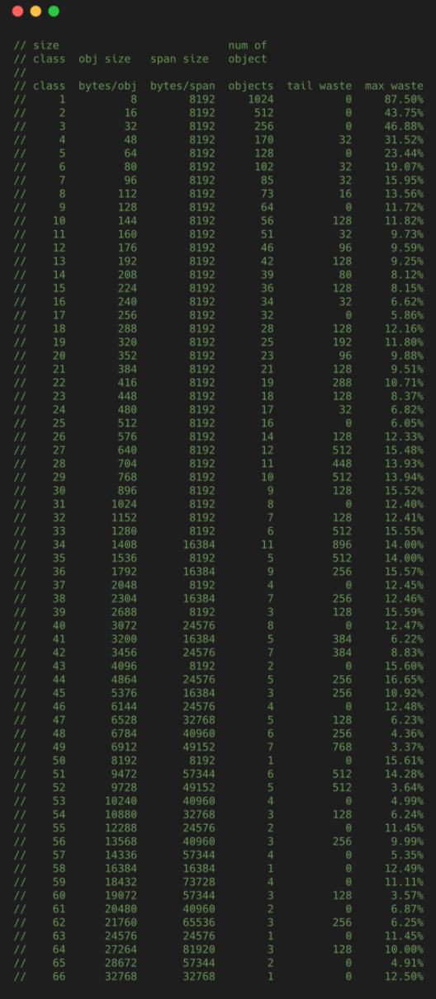

# 内存的由来

1. 如果CPU直接访问硬盘，CPU能充分利用吗？
2. 如果CPU直接访问内存，CPU能充分利用吗？

CPU速度很快，但硬盘等持久存储很慢，如果CPU直接访问磁盘，磁盘可以拉低CPU的速度，机器整体性能就会低下，为了弥补这2个硬件之间的速率差异，所以在CPU和磁盘之间增加了比磁盘快很多的内存。

然而，CPU跟内存的速率也不是相同的，从上图可以看到，CPU的速率提高的很快（摩尔定律），然而内存速率增长的很慢，**虽然CPU的速率现在增加的很慢了，但是内存的速率也没增加多少，速率差距很大**，从1980年开始CPU和内存速率差距在不断拉大，为了弥补这2个硬件之间的速率差异，所以在CPU跟内存之间增加了比内存更快的Cache，Cache是内存数据的缓存，可以降低CPU访问内存的时间.

三级Cache分别是L1、L2、L3，它们的速率是三个不同的层级，L1速率最快，与CPU速率最接近，是RAM速率的100倍，L2速率就降到了RAM的25倍，L3的速率更靠近RAM的速率。

# 虚拟内存

上图展示了某进程访问数据，当Cache没有命中的时候，访问虚拟内存获取数据的过程。

访问内存，实际访问的是虚拟内存，虚拟内存通过页表查看，当前要访问的虚拟内存地址，是否已经加载到了物理内存，如果已经在物理内存，则取物理内存数据，如果没有对应的物理内存，则从磁盘加载数据到物理内存，并把物理内存地址和虚拟内存地址更新到页表。

**物理内存就是磁盘存储缓存层**。

另外，在没有虚拟内存的时代，物理内存对所有进程是共享的，多进程同时访问同一个物理内存存在并发访问问题。**引入虚拟内存后，每个进程都要各自的虚拟内存，内存的并发访问问题的粒度从多进程级别，可以降低到多线程级别**。

# 堆和栈

上图展示了一个进程的虚拟内存划分，代码中使用的内存地址都是虚拟内存地址，而不是实际的物理内存地址。栈和堆只是虚拟内存上2块不同功能的内存区域：

- **栈在高地址，从高地址向低地址增长。**
- **堆在低地址，从低地址向高地址增长。**

**栈和堆相比有这么几个好处**：

1. 栈的内存管理简单，分配比堆上快。
2. 栈的内存不需要回收，而堆需要，无论是主动free，还是被动的垃圾回收，这都需要花费额外的CPU。
3. 栈上的内存有更好的局部性，堆上内存访问就不那么友好了，CPU访问的2块数据可能在不同的页上，CPU访问数据的时间可能就上去了。

# 堆内存管理

当我们说内存管理的时候，主要是指堆内存的管理，因为栈的内存管理不需要程序去操心。这小节看下堆内存管理干的是啥，如上图所示主要是3部分：**分配内存块，回收内存块和组织内存块**。

在一个最简单的内存管理中，堆内存最初会是一个完整的大块，即未分配内存，当来申请的时候，就会从未分配内存，分割出一个小内存块(block)，然后用链表把所有内存块连接起来。需要一些信息描述每个内存块的基本信息，比如大小(size)、是否使用中(used)和下一个内存块的地址(next)，内存块实际数据存储在data中。

一个内存块包含了3类信息，如下图所示，元数据、用户数据和对齐字段，内存对齐是为了提高访问效率。下图申请5Byte内存的时候，就需要进行内存对齐。

go中map的实现也是应用到了内存对齐

==释放内存实质是把使用的内存块从链表中取出来，然后标记为未使用，当分配内存块的时候，可以从未使用内存块中有先查找大小相近的内存块，如果找不到，再从未分配的内存中分配内存。==

上面这个简单的设计中还没考虑内存碎片的问题，因为随着内存不断的申请和释放，内存上会存在大量的碎片，降低内存的使用率。为了解决内存碎片，可以将2个连续的未使用的内存块合并，减少碎片。

#  ==---------**TCMalloc**---------==

**TCMalloc是Thread Cache Malloc的简称，是Go内存管理的起源**，Go的内存管理是借鉴了TCMalloc，并不是完全使用随着Go的迭代，Go的内存管理与TCMalloc不一致地方在不断扩大，但**其主要思想、原理和概念都是和TCMalloc一致的**，如果跳过TCMalloc直接去看Go的内存管理，也许你会似懂非懂。

在Linux里，其实有不少的内存管理库，比如glibc的ptmalloc，FreeBSD的jemalloc，Google的tcmalloc等等，为何会出现这么多的内存管理库？本质都是**在多线程编程下，追求更高内存管理效率**：更快的分配是主要目的。

## TCMalloc的做法是什么呢？

**为每个线程预分配一块缓存，线程申请小内存时，可以从缓存分配内存**，这样有2个好处：

1. 为线程预分配缓存需要进行1次系统调用，后续线程申请小内存时，从缓存分配，都是在用户态执行，没有系统调用，**缩短了内存总体的分配和释放时间，这是快速分配内存的第二个层次**。
2. 多个线程同时申请小内存时，从各自的缓存分配，访问的是不同的地址空间，无需加锁，**把内存并发访问的粒度进一步降低了，这是快速分配内存的第三个层次**。

==Page==：操作系统对内存管理以页为单位，TCMalloc也是这样，只不过TCMalloc里的Page大小与操作系统里的大小并不一定相等，而是倍数关系。《TCMalloc解密》里称x64下Page大小是8KB。

==Span==：一组连续的Page被称为Span，比如可以有2个页大小的Span，也可以有16页大小的Span，Span比Page高一个层级，是为了方便管理一定大小的内存区域，Span是TCMalloc中内存管理的基本单位。

==ThreadCache==**：每个线程各自的Cache，一个Cache包含多个空闲内存块链表，每个链表连接的都是内存块，同一个链表上内存块的大小是相同的，也可以说按内存块大小，给内存块分了个类，这样可以根据申请的内存大小，快速从合适的链表选择空闲内存块。由于每个线程有自己的ThreadCache，所以ThreadCache访问是无锁的。**

==CentralCache==：是所有线程共享的缓存，也是保存的空闲内存块链表，链表的数量与ThreadCache中链表数量相同，当ThreadCache内存块不足时，可以从CentralCache取，当ThreadCache内存块多时，可以放回CentralCache。由于CentralCache是共享的，**所以它的访问是要加锁的。**

==PageHeap==：PageHeap是堆内存的抽象，PageHeap存的也是若干链表，链表保存的是Span，当CentralCache没有内存的时，会从PageHeap取，把1个Span拆成若干内存块，添加到对应大小的链表中，当CentralCache内存多的时候，会放回PageHeap。如下图，分别是1页Page的Span链表，2页Page的Span链表等，最后是large span set，这个是用来保存中大对象的。毫无疑问，**PageHeap也是要加锁的**。

上文提到了小、中、大对象，Go内存管理中也有类似的概念，我们瞄一眼TCMalloc的定义：

1. 小对象大小：0~256KB
2. 中对象大小：257~1MB
3. 大对象大小：>1MB

小对象的分配流程：ThreadCache -> CentralCache -> HeapPage，大部分时候，ThreadCache缓存都是足够的，不需要去访问CentralCache和HeapPage，无锁分配加无系统调用，分配效率是非常高的。

中对象分配流程：直接在PageHeap中选择适当的大小即可，128 Page的Span所保存的最大内存就是1MB。

大对象分配流程：从large span set选择合适数量的页面组成span，用来存储数据。

# ==---------- Go内存管-------==

**Page**

与TCMalloc中的Page相同，x64下1个Page的大小是8KB。上图的最下方，1个浅蓝色的长方形代表1个Page。

**Span**

与TCMalloc中的Span相同，**Span是内存管理的基本单位**，代码中为mspan，**一组连续的Page组成1个Span**，所以上图一组连续的浅蓝色长方形代表的是一组Page组成的1个Span，另外，1个淡紫色长方形为1个Span。

**mcache**

mcache与TCMalloc中的ThreadCache类似，**mcache保存的是各种大小的Span，并按Span class分类，小对象直接从mcache分配内存，它起到了缓存的作用，并且可以无锁访问**。

但mcache与ThreadCache也有不同点，TCMalloc中是每个线程1个ThreadCache，Go中是**每个P拥有1个mcache**，因为在Go程序中，当前最多有GOMAXPROCS个线程在用户态运行，所以最多需要GOMAXPROCS个mcache就可以保证各线程对mcache的无锁访问，线程的运行又是与P绑定的，把mcache交给P刚刚好。

**mcentral**

mcentral与TCMalloc中的CentralCache类似，**是所有线程共享的缓存，需要加锁访问**，它按Span class对Span分类，串联成链表，当mcache的某个级别Span的内存被分配光时，它会向mcentral申请1个当前级别的Span。

但mcentral与CentralCache也有不同点，CentralCache是每个级别的Span有1个链表，mcache是每个级别的Span有2个链表，这和mcache申请内存有关，稍后我们再解释。

**mheap**

mheap与TCMalloc中的PageHeap类似，**它是堆内存的抽象，把从OS申请出的内存页组织成Span，并保存起来**。当mcentral的Span不够用时会向mheap申请，mheap的Span不够用时会向OS申请，向OS的内存申请是按页来的，然后把申请来的内存页生成Span组织起来，同样也是需要加锁访问的。

但mheap与PageHeap也有不同点：mheap把Span组织成了树结构，而不是链表，并且还是2棵树，然后把Span分配到heapArena进行管理，它包含地址映射和span是否包含指针等位图，这样做的主要原因是为了更高效的利用内存：分配、回收和再利用。

## **大小转换**

1. **object size**：代码里简称size，指申请内存的对象大小。
2. **size class**：代码里简称class，它是size的级别，相当于把size归类到一定大小的区间段，比如size[1,8]属于size class 1，size(8,16]属于size class 2。
3. **span class**：指span的级别，但span class的大小与span的大小并没有正比关系。span class主要用来和size class做对应，1个size class对应2个span class，2个span class的span大小相同，只是功能不同，1个用来存放包含指针的对象，一个用来存放不包含指针的对象，不包含指针对象的Span就无需GC扫描了。
4. **num of page**：代码里简称npage，代表Page的数量，其实就是Span包含的页数，用来分配内存。

前3列分别是size class，object size和span size，根据这3列做size、size class和num of page之间的转换。

