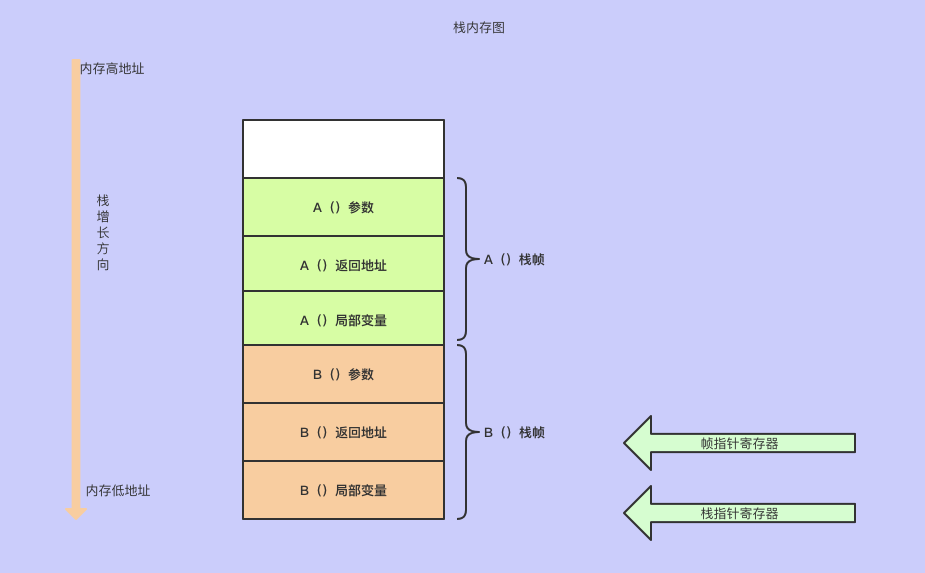

# 查看代码逃逸分析

```go
go build -gcflags '-m  -l' test4-tyfx.go


结果
-> % go build -gcflags '-m  -l' test4-tyfx.go 
# command-line-arguments
./test4-tyfx.go:8:22: leaking param: name
./test4-tyfx.go:9:10: new(Student) escapes to heap

```

```
go build -gcflags '-m -m -l' test4-tyfx.go

结果
-> % go build -gcflags '-m -m -l' test4-tyfx.go 
# command-line-arguments
./test4-tyfx.go:8:22: parameter name leaks to {heap} with derefs=0:
./test4-tyfx.go:8:22:   flow: {heap} = name:
./test4-tyfx.go:8:22:     from s.Name = name (assign) at ./test4-tyfx.go:10:9
./test4-tyfx.go:9:10: new(Student) escapes to heap:
./test4-tyfx.go:9:10:   flow: s = &{storage for new(Student)}:
./test4-tyfx.go:9:10:     from new(Student) (spill) at ./test4-tyfx.go:9:10
./test4-tyfx.go:9:10:     from s := new(Student) (assign) at ./test4-tyfx.go:9:4
./test4-tyfx.go:9:10:   flow: ~r2 = s:
./test4-tyfx.go:9:10:     from return s (return) at ./test4-tyfx.go:12:2
./test4-tyfx.go:8:22: leaking param: name
./test4-tyfx.go:9:10: new(Student) escapes to heap

```

```
go build -gcflags=-m  test4-tyfx.go


# command-line-arguments
./test4-tyfx.go:8:6: can inline StudentRegister
./test4-tyfx.go:14:6: can inline main
./test4-tyfx.go:15:17: inlining call to StudentRegister
./test4-tyfx.go:8:22: leaking param: name
./test4-tyfx.go:9:10: new(Student) escapes to heap
./test4-tyfx.go:15:17: new(Student) does not escape//无法逃逸

```


```
go build -gcflags=all="-N -l" main.go
test测试查看内存分配过程
```


# 逃逸分析总结

1.  <font color=green size=5x>栈上分配内存比在堆上分配内存有更高的效率</font>
2.  <font color=green size=5x>栈上分配的内存不需要GC处理</font>
3.  <font color=red size=5x>堆上分配的内存使用完完毕会交给GC处理</font>
4.  <font color=red size=5x>逃逸分析在编译阶段完成</font>
5.  <font color=red size=5x>逃逸分析决定内存分配地址是栈还是堆</font>

-  <font color=green size=5x>数据类型不确定</font>
-  <font color=green size=5x>外部指针引用</font>
-  <font color=green size=5x>栈空间不足</font>
-  <font color=green size=5x>闭包引用-寄存器原理</font>
-  <font color=green size=5x>变量大小不确定</font>


# 堆和栈

在Go中，栈的内存是由编译器自动进行分配和释放，栈区往往存储着<font color=red size=5x>函数参数、局部变量和调用函数帧，他们随着函数的创建和分配，函数的推出而摧毁，</font><font color=green size=5x>goroutine对应一个栈，栈是调用栈（call stack）的简称，一个栈通常又包含了许多的栈帧（stack frame），她描述的是函数之之间的调用关系，她本身也是以栈形式存储数据</font>




与栈不同的是，应用程序在运行时只会存在一个堆。狭隘地说，内存管理只是针对堆内存而言的。程序在运行期间可以主动从堆上申请内存，这些内存通过Go的内存分配器分配，并由垃圾收集器回收。

<font color=red size=5x>栈是每个goroutine独有的，这就意味着栈上的内存操作是不需要加锁的</font>。而堆上的内存，有时是需要加锁防止多线程冲突（为什么是有时，因为Go的内存分配策略徐熙了TCMalloc的线程缓存思想，它为每个P分配了一个mcache。从mcache内存分配也是无锁的）

而且对于程序对上的内存回收，还需要通过标记清除阶段，例如Go采用的三色标记法，但是对于栈上的内存而言，他的分配与释放非常廉价，简单来说，它只需要<font color=red size=5x>两个CPU指令：一个是分配入栈，另外一个是栈内释放</font>，而这只需要借助栈相关寄存器就可以完成

<font color=green size=5x>栈能更好的利用cpu缓存策略</font>

如果可以，Go编译器会尽可能将变量分配到到栈上。但是，当编译器无法证明函数返回后，该变量没有被引用，那么编译器就必须在堆上分配该变量，以此避免悬挂指针（dangling pointer）。另外，如果局部变量非常大，也会将其分配在堆上。


# 逃逸分析

- 如果分配在栈中，则函数结束可自行将内存回收
- 如果分配在堆中，则函数执行结束可交给GC（垃圾回收）处理

<font color=red size=5x>有了逃逸分析，返回函数局部变量将变得可能</font>

# 逃逸策略

每当函数申请新的对象，<font color=red size=5x>编译器回根据对象的是否被函数外呼引用来决定是否逃逸</font>

1. 如果函数外部没有引用，则优先放到栈中
2. 如果函数外部存在引用，则必定放到堆中

<font color=green size=5x>注意，对于函数外部没有引用的对象，也有可能放到堆中，比如内存超过栈的存储能力</font>

# 逃逸场景

## 1、指针逃逸-保留给外部指针

```go
package main
type Student struct {
    Name string
    Age  int
}
func StudentRegister(name string, age int) *Student {
    s := new(Student) //局部变量s逃逸到堆
    s.Name = name
    s.Age = age
    return s
}
func main() {
    StudentRegister("Jim", 18)
}
```

函数StduentRegister()内部为局部变量，其值通过函数返回值返回，s本身为一指针，其指向的内存地址不会是栈而是堆，这就是典型的逃逸分析

通过编译参数-gcflag=-m可以查看编译过程的逃逸分析

```
-> % go build -gcflags=-m  test4-tyfx.go
# command-line-arguments
./test4-tyfx.go:8:6: can inline StudentRegister
./test4-tyfx.go:14:6: can inline main
./test4-tyfx.go:15:17: inlining call to StudentRegister
./test4-tyfx.go:8:22: leaking param: name
./test4-tyfx.go:9:10: new(Student) escapes to heap
./test4-tyfx.go:15:17: new(Student) does not escape

```

编译过程显示第9行显示`escapes to heap` ,代表该行内存分配发生了逃逸现象


## 2、栈空间不足逃逸-变量内存较大

 ```go
package main

func Slice() {
	s := make([]int, 1000, 1000)
	for index, _ := range s {
		s[index] = index
	}
}
func main() {
	Slice()
}

 ```

上面的Slice（）函数分配了一个1000个长度的切片，是否逃逸取决于栈空间是否足够大，直接看编译提示，如下

```go
-> % go build -gcflags=-m  test4-tyfx.go
# command-line-arguments
./test4-tyfx.go:9:6: can inline main
./test4-tyfx.go:4:11: make([]int, 1000, 1000) does not escape

```

没有发生逃逸，扩大数量

```go
package main

func Slice() {
	s := make([]int, 10000, 10000)
	for index, _ := range s {
		s[index] = index
	}
}
func main() {
	Slice()
}

```

当切片容量到达10000发生了逃逸

```go
-> % go build -gcflags=-m  test4-tyfx.go
# command-line-arguments
./test4-tyfx.go:9:6: can inline main
./test4-tyfx.go:4:11: make([]int, 10000, 10000) escapes to heap

```

<font color=red size=5x>当栈空间不足的时候会发生逃逸，将对象分配到堆中</font>

## 3、动态类型逃逸-变量类型不确定

很多函数参数类型为interface类型，比如fmt.Println(a...interface{})，编译期间很难确定其参数的具体类型，也会产生逃逸

```
package main

import "fmt"

func main() {
    s := "Escape"
    fmt.Println(s)
}
```


```
-> % go build -gcflags=-m  test4-tyfx.go
# command-line-arguments
./test4-tyfx.go:7:13: inlining call to fmt.Println
./test4-tyfx.go:7:13: s escapes to heap
./test4-tyfx.go:7:13: []interface {} literal does not escape
<autogenerated>:1: .this does not escape
```

第7行发生逃逸

## 4、闭包引用

```
package main

func Fibonacci() func() int {
	a, b := 0, 1
	return func() int {
		a, b = b, a+b
		return a
	}
}
func main() {
	Fibonacci()
}

```


```
-> % go build -gcflags=-m  test4-tyfx.go
# command-line-arguments
./test4-tyfx.go:5:9: can inline Fibonacci.func1
./test4-tyfx.go:10:6: can inline main
./test4-tyfx.go:4:2: moved to heap: a
./test4-tyfx.go:4:5: moved to heap: b
./test4-tyfx.go:5:9: func literal escapes to heap//函数字面量转为堆分配
```

该函数返回一个闭包，闭包函数引用了局部变量a和b，使用时通过该函数获取闭包，然后每次执行闭包都会一次输出Fibonacci数列，

```
package main

import "fmt"

func Fibonacci() func() int {
	a, b := 0, 1
	return func() int {
		a, b = b, a+b
		return a
	}
}
func main() {
	f := Fibonacci()
	for i := 0; i < 10; i++ {
		fmt.Printf("Fibonacci: %d\n", f())
	}
}

```


```
-> % go build -gcflags=-m  test4-tyfx.go
# command-line-arguments
./test4-tyfx.go:7:9: can inline Fibonacci.func1
./test4-tyfx.go:15:13: inlining call to fmt.Printf
./test4-tyfx.go:6:2: moved to heap: a
./test4-tyfx.go:6:5: moved to heap: b
./test4-tyfx.go:7:9: func literal escapes to heap
./test4-tyfx.go:15:34: f() escapes to heap
./test4-tyfx.go:15:13: []interface {} literal does not escape
<autogenerated>:1: .this does not escape
```

Fibonacci()函数中原本属于局部变量的a和b由于闭包的引用，不得不将二者放到堆上，以致产生逃逸：

## 5、变量大小不确定

```
package main

func foo() {
	n := 1
	s := make([]int, n)
	for i := 0; i < len(s); i++ {
		s[i] = i
	}
}

func main() {
	foo()
}

```


```
-> % go build -gcflags=-m  test4-tyfx.go
# command-line-arguments
./test4-tyfx.go:11:6: can inline main
./test4-tyfx.go:5:11: make([]int, n) escapes to heap
```

这次，我们在`make`方法中，没有直接指定大小，而是填入了变量`n`，这时Go逃逸分析也会将其分配到堆区去。可见，为了保证内存的绝对安全，Go的编译器可能会将一些变量不合时宜地分配到堆上，但是因为这些对象最终也会被垃圾收集器处理，所以也能接受。


# 结构体为什么有时候不传值

你会发现有些Go上线项目，它们在函数传参的时候，并没有传递结构体指针，而是直接传递的结构体。这个做法，虽然它需要值拷贝，但是这是在栈上完成的操作，开销远比变量逃逸后动态地在堆上分配内存少的多。当然该做法不是绝对的，如果结构体较大，传递指针将更合适。


